

  

<h1 align="center">SPCE — Personal Capacity AI That Learns Your Patterns</h1>

  <strong>SPCE gets to know you like someone who loves you would — learning when you can handle more, when you need to slow down, when you are falling into a last-minute pattern, and when you just need comfort.</strong>

  <em>Free time is not the same as capacity.</em>

  <a href="#-1-project-overview">Overview</a> •
  <a href="#-2-ideation--process">Ideation</a> •
  <a href="#-3-design--prototype">Prototype</a> •
  <a href="#prototype-mockup-gallery">Gallery</a> •
  <a href="#-4-what-makes-it-different">Difference</a> •
  <a href="#-5-technical-architecture--feasibility">Architecture</a>

---

| | |
| --- | --- |
| **Team** | [Member 1], [Member 2], [Member 3], [Member 4] |
| **Problem Statement** | Stress & Workload Manager |
| **Video Presentation** | [Unlisted YouTube Link] |
| **Presentation Slides** | [Public Link] |
| **UI Prototype** | [Public Figma Link] |

---

##  1. Project Overview

### ⚠️ The Problem

**Imagine this:** your bestie keeps telling you uni life is exhausting. Assignments are piling up, classes are scattered across the day, Teams meetings keep appearing, they are commuting, running errands, keeping up with friends, and somehow still expected to stay productive.

Then you check their calendar and say:

> **“But bestie… you’re free at 7 PM?”**

**That is exactly the problem: free time ≠ real capacity.**

A “free” hour can still come after **📚 classes, 🚌 commuting, 🛒 errands, 👥 social commitments, 🧠 mental load, and 😮‍💨 trying to recover**. A timetable can show an empty slot without showing whether the person living through that day can realistically handle another demanding task.

> **This is not a small problem.** In a 2025 UPM study of **1,211 higher-education students**, **60.5% reported symptoms of anxiety, 45.6% depression, and 40% stress**. *The Star* also highlighted academic pressure, career uncertainty, and financial constraints as contributors to student stress and burnout. [[1]](https://www.thestar.com.my/news/nation/2025/06/16/heavy-price-of-education)

Existing tools already help organise the day, but SPCE focuses on what those plans demand from the person:

<table>
  <thead>
    <tr>
      <th align="center">App</th>
      <th align="left">What it helps with</th>
      <th align="left">Core question</th>
    </tr>
  </thead>
  <tbody>
    <tr>
      <td align="center">
         
        <strong>Akiflow</strong>
      </td>
      <td>Tasks, calendars and time-blocking.</td>
      <td><strong>“When should I do this?”</strong></td>
    </tr>
    <tr>
      <td align="center">
         
        <strong>Tiimo</strong>
      </td>
      <td>Visual planning, routines and daily structure.</td>
      <td><strong>“What do I need to do?”</strong></td>
    </tr>
    <tr>
      <td align="center">
         
        <strong>SPCE</strong>
      </td>
      <td>Hidden workload, behavioural patterns and personal capacity.</td>
      <td><strong>“Even if I have time, can I actually handle this right now?”</strong></td>
    </tr>
  </tbody>
</table>

> **SPCE’s gap:** planning the day is not the same as understanding the person living through it.

  <strong>🧠 Mental &nbsp;·&nbsp; ⏱️ Time &nbsp;·&nbsp; ⚡ Physical &nbsp;·&nbsp; 👥 Social &nbsp;·&nbsp; 🛍️ Errands</strong>

> [!NOTE]
> **SPCE is a stress and workload management tool, not a medical diagnosis tool.**

###  Our Solution

> ## **SPCE learns how much you can realistically handle each day, not just what fits on your calendar.**

SPCE is a human-governed **Personal Capacity AI** that combines planned commitments with what actually happened, then learns repeated patterns only from evidence the user approves.

### ✨ Core SPCE Experience

| | **Feature** | **What it does** |
| --- | --- | --- |
| ⚡ | **UNLOAD** | Back Tap, speak or type what your calendar missed. |
| 🔗 | **Your Real Day** | Brings together Calendar, Reminders, Teams / Microsoft 365, class timetable and UNLOAD. |
| 🧠 | **Personal Pattern Insights** | Learns from what you actually finish, move, miss and how the workload felt. |
| 🎯 | **FIT · WHY · FIX** | Checks if something fits your capacity, explains why, then suggests the smallest practical fix. |
| 📊 | **Insights** | Shows your own capacity, focus and recovery patterns instead of a hidden score. |
| 💜 | **Comfort Circle** | Private 5-minute support session to receive short moderated encouragement. |
| 🪄 | **AR Comfort Wall** | Point your camera at a wall or desk and see received comfort notes as floating AR sticky notes. |
| 💌 | **Give Comfort** | Send one anonymous supportive note to someone who needs it. |
| 🔥 | **Kindness Streak** | One qualifying comfort action can count toward your daily streak. |
| 🙋 | **Human Control** | You approve important changes and learning before SPCE uses them later. |

> **Capture what is really happening. Learn your patterns. Protect your capacity. Give or receive support when things get heavy.**

### 🧩 What if I am the kind of person who...?

| **Pattern** | **How SPCE helps** |
| --- | --- |
| ⏳ **Leaves everything until the last minute** | Spots repeated late starts and can suggest a smaller earlier start before the final-night rush. |
| 🗓️ **Is always busy** | Looks at actual capacity, not empty calendar slots, before adding more. |
| 🧠 **Forgets small commitments** | **UNLOAD** captures errands, preparation work and small tasks immediately. |
| 🙋 **Says yes too quickly** | **FIT** checks the new commitment first and **WHY** explains the trade-off. |
| 📚 **Underestimates how long work takes** | Compares planned vs actual outcomes and surfaces repeated overruns. |
| 🌙 **Struggles late at night** | Can surface an **Evening Focus** pattern and suggest demanding work earlier. |
| 🔥 **Stacks too many heavy days** | Can surface a **Recovery** pattern and protect a lighter period. |
| 🔄 **Has unpredictable days** | **Plans changed** prevents unusual days from being treated as clean capacity evidence. |
| 😵 **Needs support, not another productivity tip** | Opens a private **Comfort Circle** instead of forcing another scheduling recommendation. |

> **SPCE does not label the user. It shows repeated evidence and lets the user decide whether a pattern should influence future recommendations.**

### 🔗 Your Real Day

SPCE can combine permitted **Calendar, Reminders, Teams / Microsoft 365, class timetable**, and quick **UNLOAD** entries so one empty slot is not mistaken for unlimited capacity.

### How SPCE works

| **Step** | **What happens** |
| --- | --- |
| **1. Capture** | Connect your real day and **UNLOAD** anything missing. |
| **2. Observe** | Check what actually happened: **Done, Partly done, Not done, or Moved**. |
| **3. Learn** | SPCE compares planned vs actual behaviour and looks for repeated personal patterns. |
| **4. Decide** | **FIT** checks capacity, **WHY** explains it, and **FIX** suggests the smallest useful adjustment. |
| **5. Approve** | You approve, reject or edit before SPCE learns from an important decision. |
| **6. Support & reflect** | Use **Comfort + AR** when support is needed, and **Insights** to see your patterns over time. |

#### 🧠 Learning your capacity

> **Example:** You plan 6 commitments on several Tuesdays, but repeatedly finish 4 and move 2. SPCE can surface **4 as a more realistic pattern**, show the evidence, and ask before using it in future decisions.

For a **last-minute pattern**, SPCE may notice that work repeatedly starts late and is later marked **A bit heavy, Not done, or Moved**. It can then suggest a smaller earlier start rather than simply telling the user to “be more productive.”

### ✅ Daily Check-In

**Activity:** `Done` · `Partly done` · `Not done` · `Moved`  
**Overall feel:** `Comfortable` · `A bit heavy` · `Too much` · `Plans changed`

The check-in separates **what happened** from **how difficult it felt** before the evidence can influence learning.

### 🪄 Comfort Circle + AR

| **Experience** | **What happens** |
| --- | --- |
| 💜 **Receive comfort** | Open a private **5-minute Comfort Circle** and receive short moderated messages without sharing your identity, schedule or reason. |
| 🪄 **Open AR View** | Point the camera at a **wall or desk** and place those messages into the space as floating sticky notes. |
| 💌 **Give comfort** | Send one short anonymous encouragement to someone else and earn up to one qualifying **Kindness Streak** credit per day. |

> **Comfort does not have to arrive as another inbox. It can appear around you.**

### 📊 Personal Pattern Insights

Insights keeps the learning visible with a **7-day capacity pattern**, **planned vs actual load**, **Evening Focus**, **Deep Work**, **Recovery**, supporting evidence, and controls to stop using a pattern.

### ✨ SPCE in one line

> **UNLOAD what your calendar misses. Learn your patterns. Protect your capacity. Give or receive comfort.**

---

##  2. Ideation & Process

###  2.1 Ideas We Considered

We started broad, then kept the ideas that supported one clear goal: **help SPCE understand what a student can realistically handle while keeping the student in control.**

| **Idea** | **Status** | **Why it stayed / changed** |
| --- | --- | --- |
| **Personal Capacity Engine** | ✅ Core | The heart of SPCE. It learns from the gap between planned and actual behaviour. |
| **Instant UNLOAD with iPhone Back Tap** | ✅ Core | Captures commitments before the student forgets them. |
| **Calendar + Reminders Connection** | ✅ Core | Reduces duplicate entry and provides the visible planned day. |
| **Microsoft Teams / Microsoft 365 Calendar** | ✅ Planned | Academic meetings and group work often live outside a personal calendar. |
| **Class Timetable Import** | ✅ Planned | Recurring lectures, labs and tutorials are a major part of student load. |
| **Choose What to Improve** | ✅ Core direction | Lets users start with the pattern that matters most to them, such as last-minute work or always-busy days. |
| **Daily Activity Check-In** | ✅ Core | Records Done, Partly done, Not done and Moved instead of assuming the plan happened. |
| **Overall Load Check-In** | ✅ Core | Separates completion from how difficult the day actually felt. |
| **Personal Capacity Learning** | ✅ Core | Repeated patterns produce a more realistic capacity model for that person. |
| **FIT / Does Not Fit** | ✅ Core | Gives a simple answer about whether another commitment appears realistic. |
| **WHY / Decision Ledger** | ✅ Core | Makes reasoning inspectable instead of opaque. |
| **Minimum-Disruption FIX** | ✅ Core | Changes as little as possible instead of rebuilding the whole schedule. |
| **Human Approval** | ✅ Core | The user remains the final authority. |
| **Self-Learning Personal Policies** | ✅ Core | Approved repeated patterns can become proposed personal rules. |
| **Comfort Circle** | ✅ Core | Creates a short, privacy-preserving support window when productivity advice is not enough. |
| **AR Support Wall** | ✅ Core direction | Turns supportive messages into spatial sticky notes on a wall or desk rather than another inbox. |
| **Give Comfort + Kindness Streak** | ✅ Core | Support works both ways and rewards one meaningful supportive action per day. |
| **Insights / Pattern Visualisation** | ✅ Core | Lets users inspect capacity, focus, load and recovery patterns. |
| **Glanceable Capacity Widget** | 🧪 Stretch | Useful after the core learning loop works. |
| **Optional Garmin Context** | 🧪 Stretch | Extra context only; SPCE must work without a wearable. |
| **Generic Mood Tracker** | ❌ Dropped | Mood alone does not explain workload fit or repeated postponement. |
| **Generic To-Do / Calendar App** | ❌ Dropped | SPCE should understand capacity, not duplicate a normal planner. |
| **Generic AI Chatbot** | ❌ Dropped | Conversation alone does not create the structured FIT, WHY, FIX and approval system. |
| **Wearable-First Stress Dashboard** | ❌ Dropped | Too hardware-dependent and too close to medical interpretation. |
| **Automatic AI Rescheduling** | ❌ Dropped | SPCE should recommend, explain and ask rather than silently rearrange the user’s life. |
| **Open Social Feed and DMs** | ❌ Dropped | Comfort Circle should stay focused and private, not become another social network. |
| **Medical Burnout Diagnosis** | ❌ Dropped | SPCE is not a diagnostic product. |

###  2.2 Ideation Boards

We used four visual boards to show how the idea moved from **understanding the problem** to **choosing SPCE**, then into the **solution flow** and the final **product ecosystem**.

#### 1. Problem Exploration

  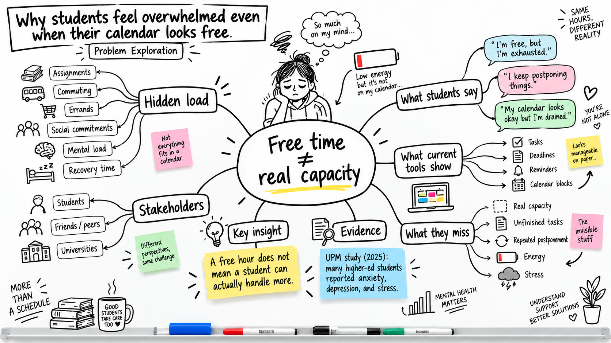

#### 2. Idea Exploration

  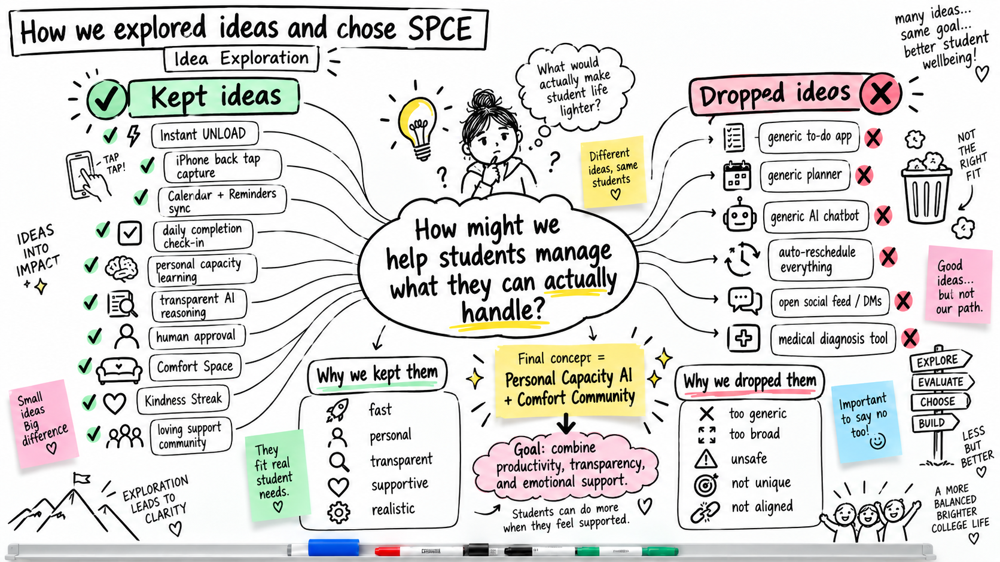

#### 3. SPCE Solution Flow

  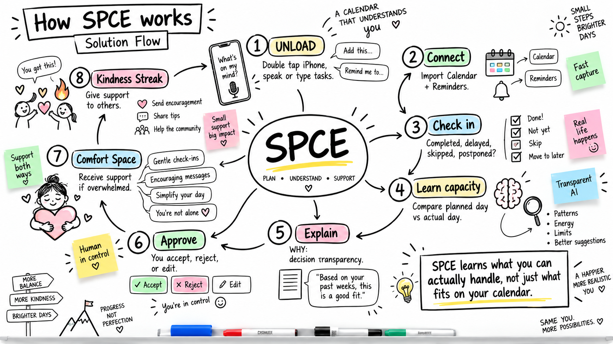

#### 4. Product Ecosystem

  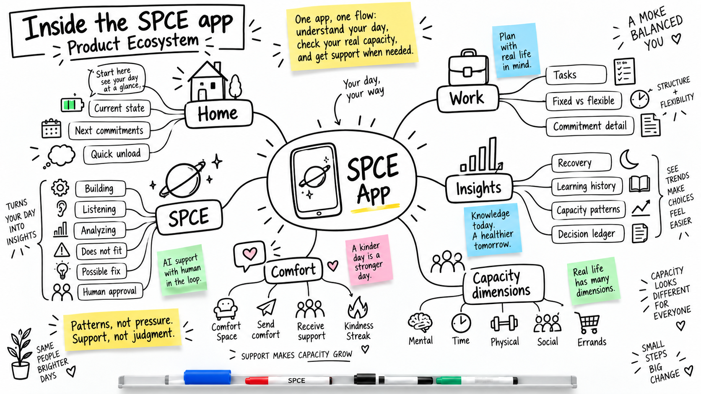

> **Our ideation path:** understand the real problem, explore different ideas, choose the strongest concept, then turn it into one connected product.

###  2.3 Mentor Consultation

We used the mentoring sessions to decide what to **adopt**, what to **pivot**, and what to **improve further**.

#### Session 1 — Buildability

| Detail | Information |
|---|---|
| **Date** | 7 Sep 2026 |
| **Time** | 11:25 PM |
| **Mentor** | **Sim Hong Bing** |

| Focus | Mentor Feedback | Our Response |
|---|---|---|
| **Hackathon scope** | Keep the **Personal Capacity AI** concept practical and realistic for the build phase. | **Adopted** — narrowed SPCE around the core capacity loop instead of trying to solve everything at once. |
| **Tech stack** | Recommended **React Native**, **Deepgram**, hosted AI, and managed services such as **Convex / Supabase**. | **Adopted** — moved toward a faster, managed stack suitable for the hackathon. |
| **AI architecture** | Use hosted AI pragmatically instead of overcomplicating the build. | **Pivoted** — AI understands input, while **Capacity, FIT, WHY, FIX, and Human Approval** remain structured and explainable. |
| **Deployment** | Flagged iOS deployment friction and suggested **Android / PWA** as fallbacks. | **Kept + fallback** — remained iOS-first because Back Tap UNLOAD is part of the experience, with Android/PWA as fallback options. |

#### Session 2 — Differentiation

| Detail | Information |
|---|---|
| **Date** | 11 Sep 2026 |
| **Time** | 11:25 PM |
| **Mentor** | **Sim Hong Bing** |

| Focus | Mentor Feedback | Our Response |
|---|---|---|
| **Differentiation** | The prototype was useful but could still feel like another productivity app. | **Pivoted** — differentiation shifted toward **Personal Pattern Insights** and capacity-aware reasoning. |
| **Why now?** | Make SPCE more memorable and clearly show why the product matters now. | **Improved** — strengthened **WHY, Insights, and Human Approval** so the intelligence is visible and explainable. |
| **Experience** | Explore realtime AI, generated visuals, gamification, bots, avatars, or unconventional interaction. | **Adapted, not copied** — added **Comfort Circle, Give Comfort + Kindness Streak, and the AR Comfort Wall** instead of turning SPCE into a generic chatbot or gamified calendar. |

> **Mentor impact:** Session 1 made SPCE **more buildable**. Session 2 made it **more distinctive and memorable** without losing the core Personal Capacity AI idea.

---

##  3. Design & Prototype

**UI Prototype:** [Public Figma Link]

SPCE is designed as **one continuous, playable mobile experience** — not a collection of disconnected screens.

### Primary Navigation

| Area | Purpose |
|---|---|
| 🏠 **Home** | See today’s capacity, commitments, UNLOAD, and start a daily check-in |
| 💼 **Work** | Plan the real day through **UNLOAD → FIT → WHY → FIX → Approval** |
| 💜 **Comfort** | Receive or give support through Comfort Circle, AR Notes, and Kindness Streak |
| 📊 **Insights** | Understand capacity, focus, recovery, and learned personal patterns |

### Core Prototype Journeys

| Journey | Flow |
|---|---|
| 💼 **Planning** | Real Day → UNLOAD → FIT → WHY → FIX → Human Approval → Confirmation |
| 🧠 **Daily Learning** | Check in today → Activity outcomes → Overall feel → Review → Approved learning |
| 💜 **Receive Comfort** | I need comfort → 5-minute Circle → Live session → AR setup → AR comfort notes |
| 🤝 **Give Comfort** | Give comfort → Send note → Comfort sent → Kindness Streak |
| 📊 **Insights** | 7-day capacity pattern → Pattern detail → Evidence → What it affects |

> The planning flow handles **what should happen next**.  
> The later check-in records **what actually happened and how the day felt**.

###  Prototype Mockups

<table>
<tr>
<td align="center" width="25%">
  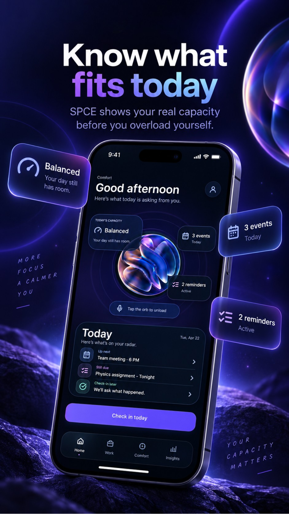 
  <strong>Home</strong> 
  See what fits today before overload starts.
</td>
<td align="center" width="25%">
  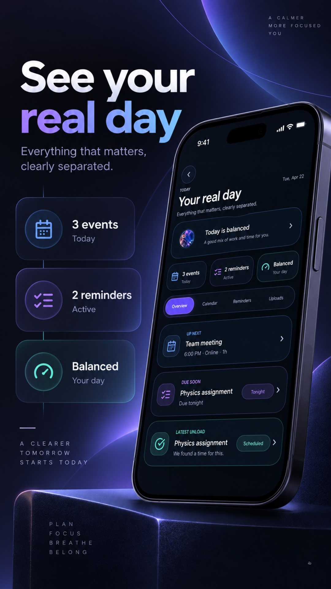 
  <strong>Real Day</strong> 
  Bring events, reminders, and real commitments together.
</td>
<td align="center" width="25%">
  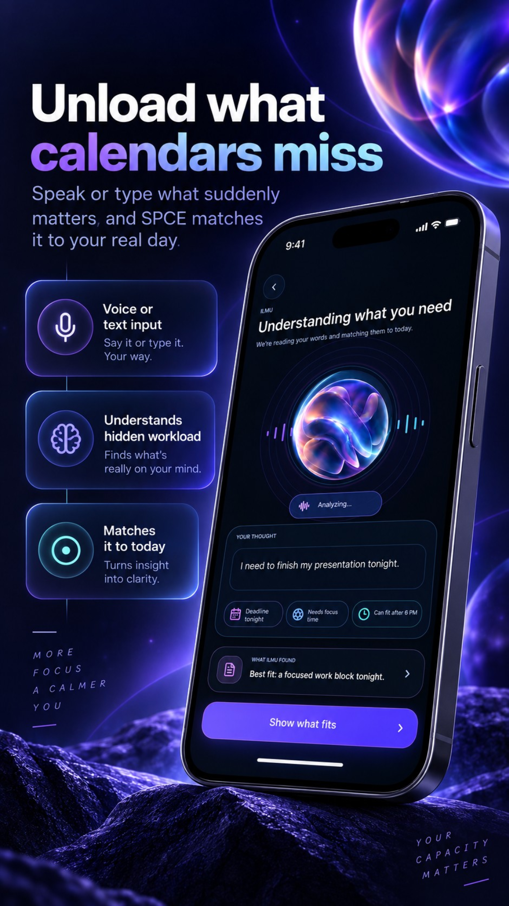 
  <strong>UNLOAD</strong> 
  Capture what calendars usually miss.
</td>
<td align="center" width="25%">
  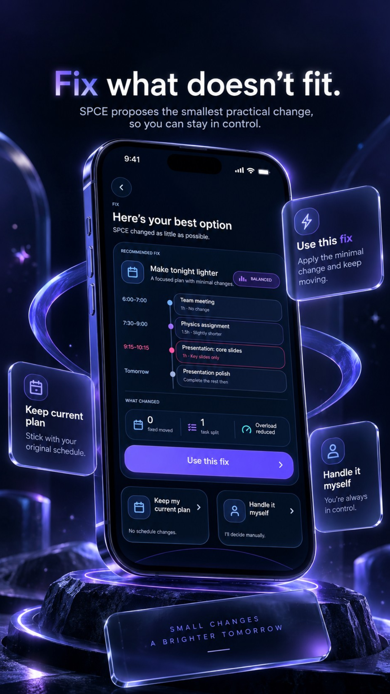 
  <strong>FIX</strong> 
  Make the smallest practical change that helps.
</td>
</tr>

<tr>
<td align="center" width="25%">
  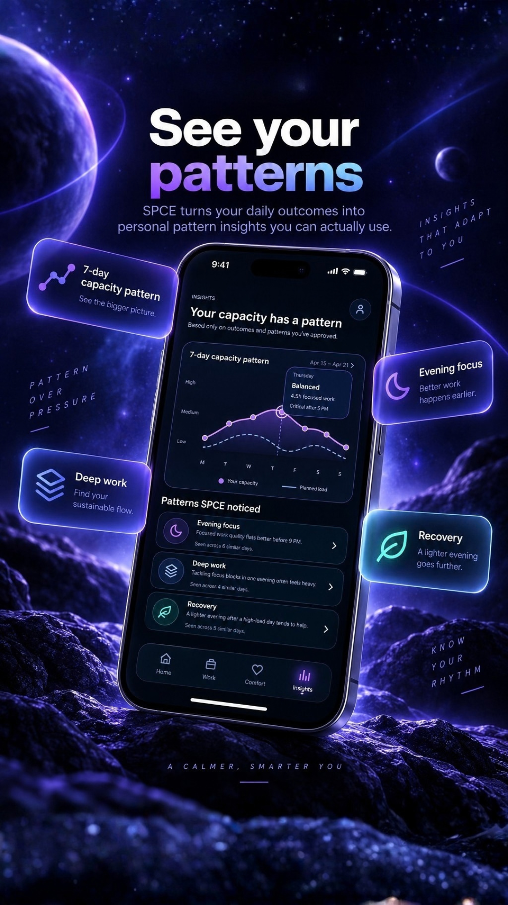 
  <strong>Insights</strong> 
  Turn daily outcomes into personal capacity patterns.
</td>
<td align="center" width="25%">
  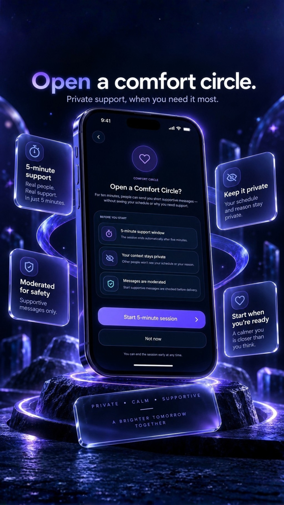 
  <strong>Comfort Circle</strong> 
  Open a private five-minute support space.
</td>
<td align="center" width="25%">
  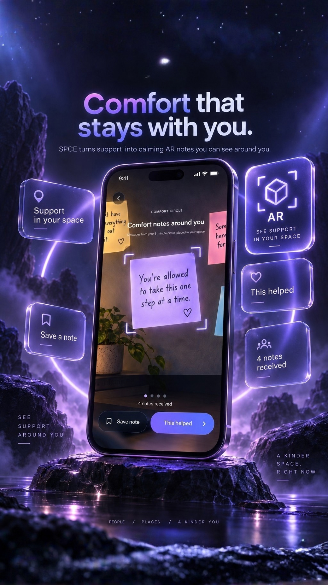 
  <strong>AR Comfort</strong> 
  See supportive notes around you in AR.
</td>
<td align="center" width="25%">
  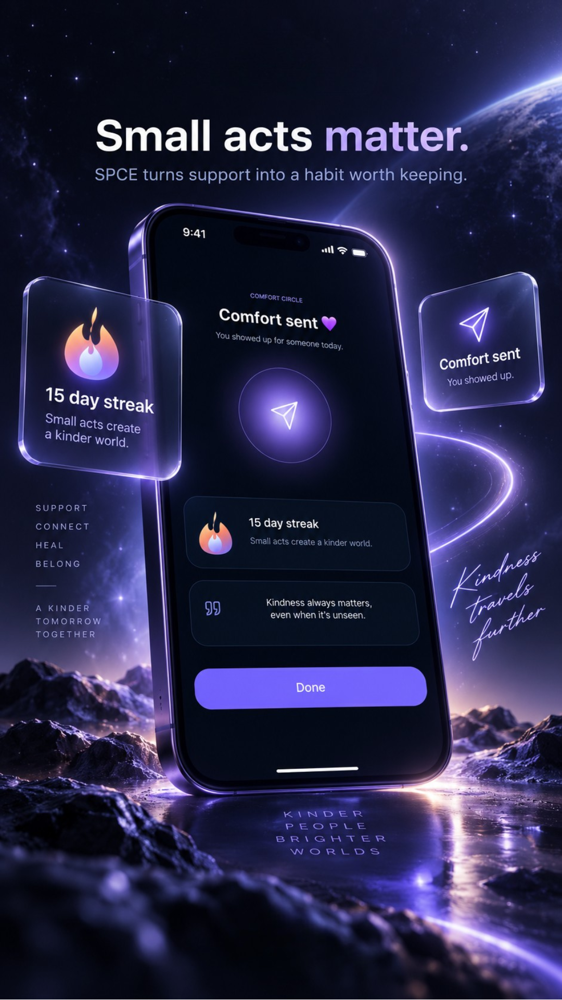 
  <strong>Kindness Streak</strong> 
  Give comfort and keep small acts of kindness going.
</td>
</tr>

<tr>
<td align="center" colspan="4">
  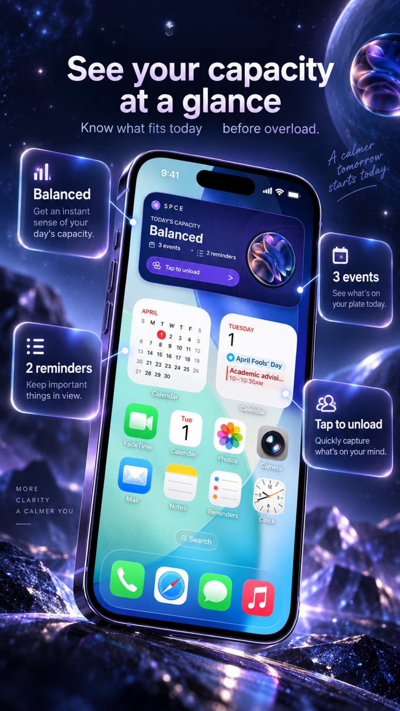 
  <strong>Widget</strong> 
  See today’s capacity and UNLOAD at a glance.
</td>
</tr>
</table>

---

##  4. What Makes It Different

SPCE is not trying to become another task manager. Its main difference is that it learns from the gap between **what you planned**, **what actually happened**, and **how the load felt**.

###  Novel Features

| **Feature** | **What makes it different** |
| --- | --- |
| ⚡ **Instant UNLOAD** | Back Tap + voice/text captures invisible commitments before the user forgets them. |
| 🔗 **One real-day context** | SPCE can combine calendar, reminders, Teams / Microsoft 365 commitments, class timetable and UNLOAD instead of treating one calendar as the whole truth. |
| 🎯 **Choose what to improve** | A student can start with the pattern they care about, including last-minute work, always-busy days, forgotten commitments or recovery. |
| 🧠 **Personal Capacity Learning** | Capacity is learned from the user’s own outcomes rather than a generic productivity target. |
| ✅ **Activity-level outcomes** | SPCE distinguishes Done, Partly done, Not done and Moved instead of only asking whether the day was “good” or “bad.” |
| 🌡️ **Outcome feel** | Completion is separated from perceived load: Comfortable, A bit heavy, Too much or Plans changed. |
| 🔍 **Transparent AI** | WHY shows the evidence and reasoning behind important recommendations. |
| 🙋 **Human approval first** | The user approves, rejects or edits before SPCE learns a personal policy. |
| 🛠️ **Minimum-disruption FIX** | SPCE looks for the smallest change that makes the plan realistic. |
| 💜 **Comfort Circle** | A private five-minute support session gives encouragement without exposing schedule or identity. |
| 🪄 **AR Support Wall** | Comfort notes appear as floating spatial sticky notes on a nearby wall or desk rather than an inbox. |
| 🔥 **Kindness Streak** | Users can give one meaningful supportive message and build a daily streak without encouraging spam. |
| 📊 **Pattern visualisation** | Insights shows capacity, focus, deep-work and recovery patterns instead of reducing the person to one score. |
| 🧩 **Pattern controls** | Users can inspect what a pattern affects and stop SPCE from using it. |

> **The SPCE idea in one line:** learn the person behind the calendar, help them improve the pattern that gets in the way, keep the AI explainable, keep the human in control, and make support part of the experience.

###  Market Positioning

| **Capability** | **SPCE** | **Akiflow** | **Tiimo** |
| --- | --- | --- | --- |
| Task / calendar planning | ✅ Capacity-aware | ✅ Scheduling / time blocking | ✅ Visual planning |
| Multi-source student context | ✅ Calendar + reminders + planned Teams / timetable inputs | ◐ Calendar integrations | ◐ Calendar / planning integrations |
| Fast invisible-commitment capture | ✅ Back Tap + voice/text UNLOAD | ✅ Inbox + shortcuts | ✅ Quick planning tools |
| Daily activity outcome check-in | ✅ Feeds capacity learning | ◐ Review / stats | ◐ Daily review |
| Personal capacity model | ✅ Five capacity dimensions + history | ❌ Primarily task / time focus | ◐ Wellbeing + planning |
| Last-minute / always-busy pattern focus | ✅ Explicit improvement goal + learned evidence | ◐ General productivity planning | ◐ Flexible routine support |
| Explains why something does not fit | ✅ WHY / Decision Ledger | ❌ No SPCE-style capacity ledger | ❌ No SPCE-style capacity ledger |
| Human approval before learning policy | ✅ Explicit approval | ❌ No SPCE capacity-policy gate | ❌ No SPCE capacity-policy gate |
| Smallest workload fix | ✅ Minimum disruption | ◐ Rescheduling | ◐ Reshuffling |
| Private peer support | ✅ Comfort Circle | ❌ | ❌ |
| AR comfort message experience | ✅ Planned AR Support Wall | ❌ | ❌ |
| Capacity pattern visualisation | ✅ Insights | ◐ Productivity stats | ◐ Planning / wellbeing views |

> **The key difference:** SPCE is built around the question **“What can this person realistically handle?”** rather than only **“Where can this task fit?”**

---

##  5. Technical Architecture & Feasibility

###  Planned Tech Stack

We designed the stack around four priorities: **fast mobile interaction, explainable AI, human control, and a realistic hackathon build**.

> [!IMPORTANT]
> The AI is not the final decision-maker. Language models help understand user input. SPCE’s capacity, FIT, WHY, FIX, approval and learning logic stay structured and inspectable.

| **Layer** | **Planned technology / approach** | **Role in SPCE** |
| --- | --- | --- |
| 📱 **Mobile App** | React Native + TypeScript + Expo Development Build | Main iPhone experience |
| 🧭 **Navigation** | Expo Router | Home, Work, Comfort, Insights and deep links |
| 👆 **Back Tap UNLOAD** | iOS Back Tap + Shortcut / App Intent + Deep Link | Fast entry into UNLOAD |
| 📅 **Apple Calendar + Reminders** | Apple EventKit integration | Reads permitted planned commitments |
| 💼 **Teams / Microsoft 365 Calendar** | Planned Microsoft calendar connector | Brings academic meetings and Teams-linked schedule context into the real-day view |
| 🎓 **Class Timetable** | Planned timetable import / recurring schedule adapter | Adds lectures, labs and tutorials |
| 🎙️ **Voice Capture** | Deepgram | Speech to text for fast UNLOAD |
| 🧩 **Context Parser** | ILMU LLM | Understands natural language and converts it into structured context |
| 🧾 **Structured AI Contracts** | JSON + Zod | Validates model output before it reaches core logic |
| 🧠 **Capacity Engine** | Deterministic TypeScript rules + user history | Planned vs actual capacity reasoning |
| 🎯 **FIT / WHY / FIX** | Deterministic decision rules | Capacity decision, explanation and minimum-disruption fix |
| 🙋 **Human Approval** | Approval state machine + Decision Ledger | Approve, reject or edit before learning |
| 📈 **Capacity Learning** | Behaviour history + lightweight pattern scoring | Detects repeated personal patterns |
| 📊 **Insights** | Structured pattern summaries + visualisation | Shows capacity, focus and recovery evidence |
| 🗄️ **Database** | Supabase Postgres | Commitments, check-ins, capacity patterns, approvals and Comfort data |
| 🔐 **Auth + Access** | Supabase Auth + Row Level Security | Per-user account isolation |
| ⚡ **Realtime Comfort** | Supabase Realtime | Temporary Comfort Circle message delivery |
| 🛡️ **Comfort Moderation** | Rule checks + moderation service | Screens messages before delivery |
| 🪄 **AR Support Wall** | Planned iOS AR surface detection + anchored note rendering | Detects a wall / desk and places comfort notes spatially |
| 🔔 **Notifications** | Expo Notifications + APNs | Check-in reminders and Comfort events |
| ☁️ **Secure Proxy** | Cloudflare Workers | Protects service credentials and coordinates secure calls |
| 🗃️ **Local Cache** | Secure local storage | Small local state and faster app response |
| ⌚ **Wearable Context** | Optional Garmin integration | Stretch context only; not required for SPCE |
| 🚀 **Build / Distribution** | Expo EAS Build / TestFlight | Installable iOS testing build |

### What runs the intelligence?

| **Layer** | **Responsibility** |
| --- | --- |
| 🗣️ **Understand** | ILMU converts messy voice/text into structured commitments and context. |
| 🧠 **Decide** | Capacity, FIT, WHY and FIX evaluate what is realistic using structured logic. |
| 🙋 **Govern** | The user reviews and approves important decisions and learning evidence. |
| 📈 **Learn** | Approved outcomes and repeated patterns influence future capacity estimates. |
| 📊 **Explain** | Insights and the Decision Ledger show what SPCE learned and why it matters. |

###  Architecture Principle

> **AI understands. SPCE reasons. Humans approve. The system learns.**

A model may help interpret:

> “I still need to finish my assignment, I have a Teams meeting later, I need groceries, and I’m exhausted after class.”

But the actual capacity decision remains structured:

> **Context → Capacity → FIT → WHY → FIX → Human Approval → Check-In → Approved Learning**

###  System Architecture

  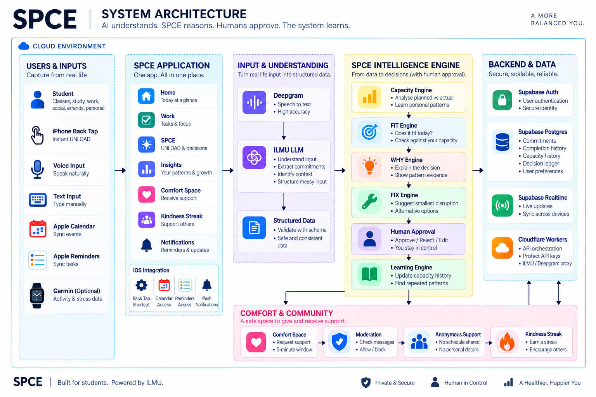

**Architecture zones to reflect in the next diagram update:**

| **Zone** | **Include** |
| --- | --- |
| **Users & Inputs** | Student, Back Tap, voice/text, Apple Calendar, Reminders, Teams / Microsoft 365 calendar, class timetable, optional Garmin |
| **SPCE Application** | Home, Work, Comfort, Insights, UNLOAD, Check-In, Kindness Streak |
| **Input & Understanding** | Deepgram, ILMU, structured data |
| **SPCE Intelligence** | Capacity, FIT, WHY, FIX, Human Approval, learning |
| **Insights** | 7-day capacity pattern, focus, deep work, recovery, pattern controls |
| **Comfort & Community** | Comfort Circle, moderation, Give Comfort, Kindness Streak |
| **AR Layer** | Wall / desk surface detection, anchored sticky notes, selected comfort note |
| **Backend & Data** | Supabase Auth, Postgres, Realtime, secure API proxy |

###  Build Plan & Scope

| **Build Window** | **21 September 2026 to 11 October 2026** |
| --- | --- |
| **Goal** | Prove one complete SPCE loop from real-day context to capacity learning, explanation, human approval and support |
| **Platform** | iOS-first hackathon build |
| **Success Standard** | Working end-to-end experience, not maximum feature count |

#### Core Build

| **Priority** | **Feature** | **Done when** |
| --- | --- | --- |
| P0 | ⚡ **UNLOAD** | User can capture an invisible commitment quickly by voice or text |
| P0 | 📅 **Connected commitments** | Calendar, reminders and timetable context can appear in one real-day view |
| P0 | 🎯 **Improvement focus** | User can choose what they want SPCE to help improve first |
| P0 | ✅ **Activity Check-In** | User can record Done, Partly done, Not done or Moved |
| P0 | 🌡️ **Overall Feel** | User can record Comfortable, A bit heavy, Too much or Plans changed |
| P0 | 🧠 **Capacity Engine** | SPCE compares planned vs actual behaviour |
| P0 | 🎯 **FIT / Does Not Fit** | A new commitment can be checked against current capacity |
| P0 | 🔍 **WHY** | Reasoning and evidence are visible |
| P0 | 🛠️ **FIX** | SPCE proposes the smallest practical adjustment |
| P0 | 🙋 **Human Approval** | User approves, rejects or edits before learning |
| P0 | 📖 **Learning History** | Approved evidence can influence later capacity estimates |
| P1 | 💜 **Comfort Circle** | Private five-minute support flow works |
| P1 | 🪄 **AR Support Wall** | Received comfort notes can be demonstrated on a detected wall / desk surface |
| P1 | 🔥 **Give Comfort + Kindness Streak** | User can send one supportive note and receive streak credit |
| P1 | 📊 **Insights** | Capacity, focus and recovery patterns are visible |

#### Build Timeline

| **Dates** | **Focus** | **Output** |
| --- | --- | --- |
| **21 to 27 Sep** | Foundation + Real-Day Context | App setup, Supabase, UNLOAD, Deepgram, ILMU parsing, Calendar/Reminders, timetable inputs, task storage |
| **28 Sep to 4 Oct** | Core Intelligence | Activity Check-In, overall feel, Capacity, FIT, WHY, FIX, Human Approval, Decision Ledger, learning |
| **5 to 11 Oct** | Support + Polish | Comfort Circle, Give Comfort, Kindness Streak, AR Support Wall prototype, Insights, notifications, testing, UI polish |

#### Scope Boundary

| **In Scope** | **Stretch / expansion** |
| --- | --- |
| iOS-first app | Full multi-platform release |
| UNLOAD + connected commitments | Many third-party connectors |
| Basic Teams / timetable context path | Deep institution-specific timetable integrations |
| Activity + load check-in | Complex long-term ML |
| Capacity learning | Advanced model training |
| FIT, WHY, FIX | Fully autonomous rescheduling |
| Human Approval + Decision Ledger | Automatic policy changes without approval |
| Basic Comfort Circle | Large-scale community matching |
| AR Support Wall prototype | Persistent multi-user spatial rooms |
| Kindness Streak | Broader social network |
| Insights | Advanced longitudinal analytics |
| Supabase persistence | Production-scale moderation infrastructure |
| Optional Garmin later | Advanced medical / physiological interpretation |

#### Definition of Done

| **Reviewer should be able to...** | **Expected result** |
| --- | --- |
| Connect / import the day | SPCE sees planned classes, events, reminders and other permitted commitments |
| Choose an improvement focus | SPCE knows what pattern the user wants help with first |
| UNLOAD something missing | The invisible commitment appears in the real-day context |
| Complete activity check-in | SPCE knows what actually happened per activity |
| Record overall feel | SPCE separates completion from workload difficulty |
| Add another commitment | SPCE returns FIT or Does Not Fit |
| Open WHY | The evidence behind the decision is visible |
| Review FIX | A minimum-disruption adjustment is proposed |
| Approve, reject or edit | The user stays in control |
| Return later | Only approved evidence influences learning |
| Open Insights | A capacity / focus / recovery pattern is visible |
| Open Comfort Circle | A five-minute private support session works |
| Open AR view | Comfort messages appear as a spatial wall / desk experience |
| Give comfort | One supportive note can be sent without exposing the recipient |
| View Kindness Streak | Positive participation is reflected without rewarding spam |

###  Stretch Goals

- Deeper Microsoft Teams / Microsoft 365 and university timetable integrations.
- Glanceable capacity widget.
- Optional Garmin context.
- More advanced realtime voice interaction.
- Richer AR note interaction and spatial persistence.
- Advanced long-term capacity-pattern modelling.
- More detailed learning history and pattern comparison.
- Production-scale community matching and moderation.

###  Hackathon Scope Boundary

The goal is not to build every possible SPCE feature.

The goal is to demonstrate a believable closed loop:

> **REAL DAY → UNLOAD → FIT → WHY → FIX → HUMAN APPROVAL → CHECK-IN → LEARN → INSIGHTS**

and a second support loop:

> **NEED COMFORT → 5-MINUTE CIRCLE → AR SUPPORT WALL → RECOVER**

with the community side:

> **GIVE COMFORT → MODERATED NOTE → KINDNESS STREAK**

If those journeys work clearly, the wider product becomes credible.

---

  <strong>Made with Love by EAQ 💜❤️</strong>

