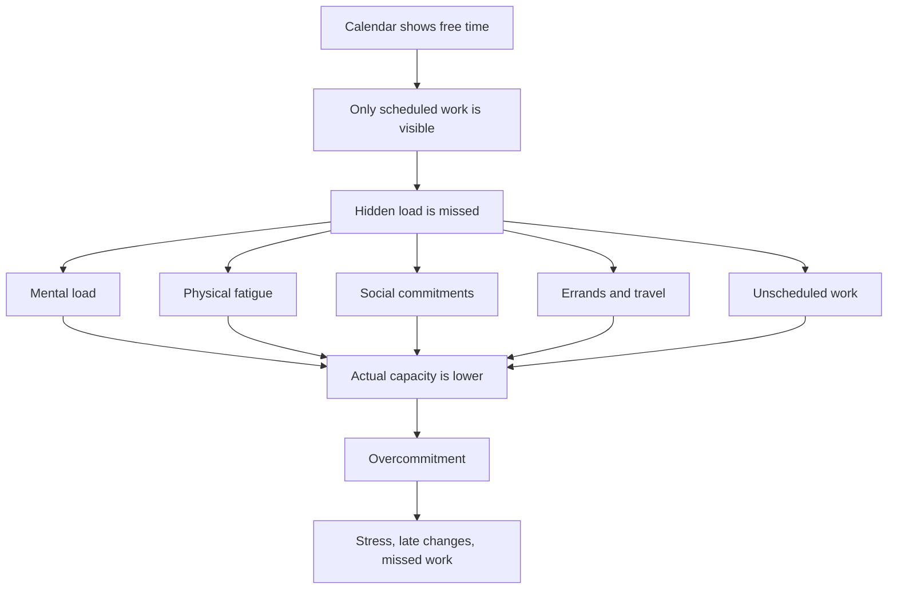
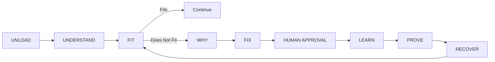
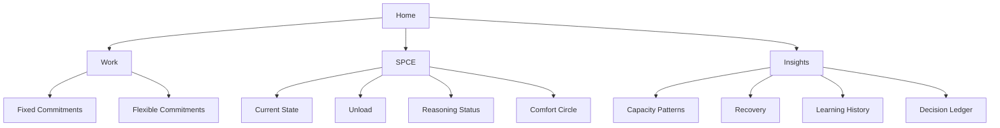
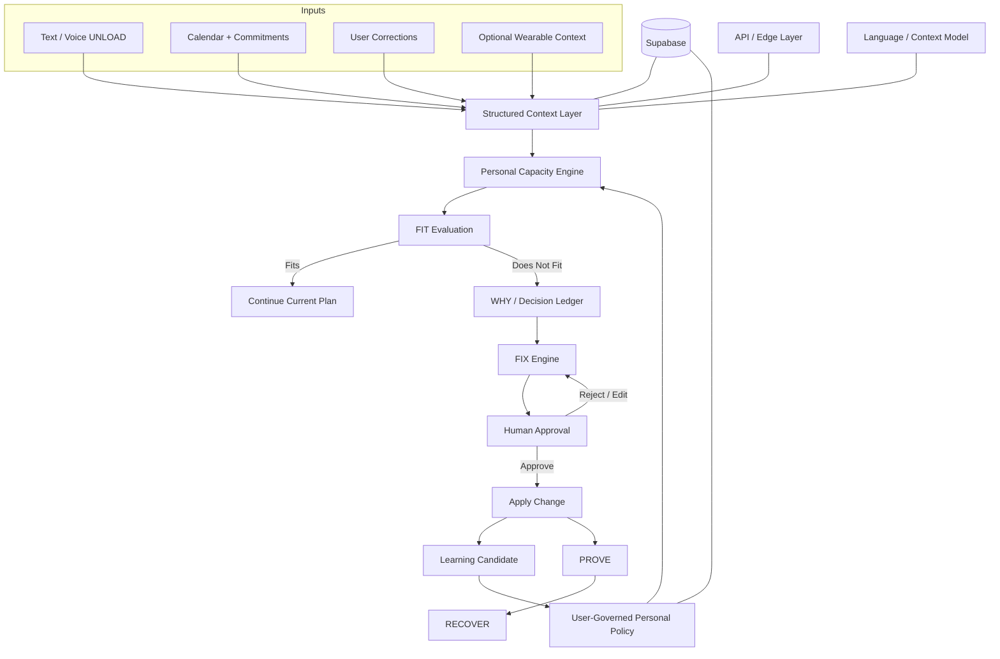

  

<h1 align="center">SPCE — Personal Capacity AI</h1>

  <strong>SPCE gets to know you like someone who loves you would — learning when you can handle more, when you need to slow down, and when you just need comfort.</strong>

  <em>Free time is not the same as capacity.</em>

  <a href="#-1-project-overview">Overview</a> •
  <a href="#-2-ideation--process">Ideation</a> •
  <a href="#-3-design--prototype">Prototype</a> •
  <a href="#-4-what-makes-it-different">Difference</a> •
  <a href="#-5-technical-architecture--feasibility">Architecture</a>

---

| | |
| --- | --- |
| **Team** | [Member 1], [Member 2], [Member 3], [Member 4] |
| **Problem Statement** | Stress & Workload Manager |
| **Video Presentation** | [Unlisted YouTube Link] |
| **Presentation Slides** | [Public Link] |
| **UI Prototype** | [Public Figma Link] |

---

##  1. Project Overview

###  The Problem

**Imagine your bestie keeps telling you uni life is exhausting.**

Assignments are piling up. They’re commuting, running errands, trying to keep up with friends, and somehow still expected to stay productive.

You check their calendar and say:

> **“But bestie… you’re free at 7 PM?”**

That’s the problem.

> [!IMPORTANT]
> **Being free doesn’t mean you still have capacity.**

A student can have an empty hour on their calendar and still be completely drained — mentally, physically, socially, or just from dealing with life.

And this is not just a “uni is stressful lol” problem.

In June 2025, *The Star* reported that a Universiti Putra Malaysia study involving **1,211 higher-education students** found that **60.5% reported symptoms of anxiety, 45.6% depression, and 40% stress**. The report also highlighted academic pressure, career uncertainty, and financial constraints as contributors to student stress and burnout. [[1]](https://www.thestar.com.my/news/nation/2025/06/16/heavy-price-of-education)

Existing tools already help students organise **time and tasks**:

- **Akiflow** helps users organise tasks, calendars, and time blocks. [[2]](https://akiflow.com/features)
- **Tiimo** helps users organise routines, reminders, tasks, and daily plans visually. [[3]](https://www.tiimoapp.com/product/visual-planning)

They are good at answering:

> **“What do I need to do, and when?”**

SPCE asks the layer underneath:

> **“Okay… but do you actually have the capacity to deal with it right now?”**

SPCE looks beyond an empty calendar slot and considers the load people usually do not schedule — **Mental, Time, Physical, Social, and Errands**.

It is built for **students**, the **friends and peers who support them**, and **universities that want to help before things get too overwhelming**.

> [!NOTE]
> **SPCE is a stress and workload management tool, not a medical diagnosis tool.**

###  Our Solution

SPCE is a human-governed **Personal Capacity AI** that learns from the user’s own approved decisions.

The flow is simple:

>

>  <strong>UNLOAD</strong> → 
>  <strong>FIT</strong> → 
>  <strong>WHY</strong> → 
>  <strong>FIX</strong> → 
>  <strong>APPROVE</strong> → 
>  <strong>LEARN</strong> → 
>  <strong>PROVE</strong> → 
>  <strong>RECOVER</strong>
> 

A student can quickly unload hidden work, check whether a new commitment actually fits their current capacity, understand **why** it may not fit, review the smallest possible fix, and approve the change before SPCE learns from it.

When things get heavy, **Comfort Circle** gives the student a short, privacy-preserving space to receive encouragement from peers without exposing their schedule or the reason they need support.

SPCE does not try to take over the user’s life. It helps them notice overload earlier, make a better call, and recover with less friction.

> [!TIP]
> **SPCE in one line:**  See the hidden load →  check real capacity →  make the smallest fix →  recover with support.

###  Core Feature Set

   <strong>Mental</strong>
  &nbsp;&nbsp;•&nbsp;&nbsp;
   <strong>Time</strong>
  &nbsp;&nbsp;•&nbsp;&nbsp;
   <strong>Physical</strong>
  &nbsp;&nbsp;•&nbsp;&nbsp;
   <strong>Social</strong>
  &nbsp;&nbsp;•&nbsp;&nbsp;
   <strong>Errands</strong>

| Feature | What it does |
| --- | --- |
| **UNLOAD** | Captures hidden workload quickly through low-friction text or voice input. |
| **Personal Capacity Model** | Represents five capacity dimensions: **Mental, Time, Physical, Social, and Errands**. |
| **FIT / Does Not Fit** | Checks whether a commitment fits the user’s current capacity, not only their empty calendar slots. |
| **WHY / Decision Ledger** | Shows the factors behind a recommendation instead of returning an unexplained answer. |
| **FIX** | Proposes the smallest practical adjustment before attempting a major schedule change. |
| **Human Approval** | Keeps the user in control of changes and what SPCE is allowed to learn from. |
| **LEARN** | Turns repeated, approved behaviour into proposed reusable personal policies. |
| **PROVE** | Surfaces the reasoning behind an approved recommendation. |
| **RECOVER** | Helps the user move back toward a workable state after overload. |
| **Fixed vs Flexible Commitments** | Distinguishes what can realistically move from what cannot. |
| **Comfort Circle** | Provides a five-minute, opt-in, privacy-preserving peer-support experience. |
| **Kindness Streak** | Recognises supportive participation without creating an open social network. |
| **Glanceable State / Widget** | Makes current capacity and the next useful action visible at a glance. |
| **Optional Wearable Context** | Can add non-medical physiological context without making a wearable mandatory. |

---

##  2. Ideation & Process

###  2.1 Ideas We Considered

Chosen ideas are listed first.

| **Idea** | **Why it was kept / dropped** |
| --- | --- |
| **Personal Capacity Engine — Chosen** | **Kept.** This became the core idea: an empty calendar slot does not automatically mean the user has usable capacity. |
| **UNLOAD — Chosen** | **Kept.** Hidden workload should be capturable before the user has perfectly organised it into a task. |
| **FIT / Does Not Fit — Chosen** | **Kept.** Gives the user a simple, understandable state while deeper reasoning remains inspectable. |
| **Minimum-disruption FIX — Chosen** | **Kept.** SPCE first looks for the smallest viable change instead of rebuilding the user’s whole day. |
| **Human Approval — Chosen** | **Kept.** The user remains the authority over proposed changes and learned behaviour. |
| **WHY / Decision Ledger — Chosen** | **Kept.** A personal AI should be able to show why it reached an important recommendation. |
| **Self-learning Personal Policies — Chosen** | **Kept.** Approved patterns can become proposed reusable rules, allowing SPCE to become more personal over time. |
| **RECOVER — Chosen** | **Kept.** Detecting overload is only useful if the product can also help the user return to a workable state. |
| **Comfort Circle — Chosen** | **Kept.** Adds human support while protecting the user’s schedule and reason for asking for help. |
| **Glanceable State / Widget — Chosen** | **Kept.** Capacity should be visible without requiring the user to reopen the full app. |
| **Optional Wearable Context — Chosen as stretch** | **Kept as optional.** It may enrich context, but SPCE must still work without a wearable. |
| **Generic Mood Tracker** | **Dropped.** Mood alone does not solve workload fit, commitment trade-offs, or hidden capacity. |
| **Generic To-do / Calendar App** | **Dropped.** It would reproduce a crowded category without addressing the core capacity problem. |
| **Generic AI Chatbot** | **Dropped.** Conversation alone does not create a structured, inspectable `FIT → WHY → FIX → APPROVE → LEARN` loop. |
| **Wearable-first Stress Dashboard** | **Dropped as the main product.** It would make the experience hardware-dependent and move the concept too close to health interpretation. |
| **Automatic AI Rescheduling** | **Dropped.** SPCE should not silently rearrange a student’s life without explicit approval. |
| **Open Social Feed / DMs** | **Dropped.** Comfort Circle is deliberately constrained and is not designed to become another social network. |
| **Medical Burnout Diagnosis** | **Dropped.** SPCE manages workload and personal capacity; it does not diagnose a medical condition. |

###  2.2 Ideation Boards

#### Board A — Problem Tree

**What it shows:** The problem is not simply poor scheduling. A meaningful portion of a student’s load may never appear as a calendar event.

#### Board B — Core SPCE Loop

**What it shows:** SPCE moves from hidden workload to an explainable decision, asks the user to approve the smallest adjustment, and learns only from accepted behaviour.

#### Board C — Product Surface

**What it shows:** The wider product is organised into four simple areas—**Home, Work, SPCE, and Insights**—while the reasoning engine remains understandable underneath.

###  2.3 Mentor Consultation

> Replace the placeholders below with the team’s actual consultation record before submission.

| **Date** | **Mentor** | **Feedback Received** | **What Was Changed** |
| --- | --- | --- | --- |
| [Date] | [Mentor Name] | [What the mentor said] | [What we changed, or why we intentionally did not change it] |
| [Date] | [Mentor Name] | [What the mentor said] | [What we changed, or why we intentionally did not change it] |

---

##  3. Design & Prototype

**UI Prototype:** [Public Figma Link]

SPCE is designed as **one continuous, playable mobile experience**, not a set of disconnected concept screens.

The prototype uses four primary areas:

- **Home** — current state, upcoming commitments, and rapid entry into SPCE.
- **Work** — commitments, including Fixed vs Flexible.
- **SPCE** — the live capacity reasoning journey.
- **Insights** — capacity patterns, recovery, learning history, and decision reasoning.

###  Key Screens to Showcase

> Export 4–8 final screenshots into an `/assets` folder before submission.

#### 1. Home — Capacity at a Glance

Shows current state, upcoming commitments, Quick Unload, and the fastest route into SPCE.

#### 2. Building / Listening — SPCE Understands First

Shows SPCE gathering context before jumping to a recommendation.

#### 3. Does Not Fit — The Core Moment

Demonstrates the key idea: a commitment may fit the calendar while still exceeding the user’s actual capacity.

#### 4. WHY / Decision Ledger — Make the AI Inspectable

Shows the reasoning behind the decision rather than asking the user to trust an opaque result.

#### 5. Possible Fix / Human Approval — AI Proposes, Human Decides

SPCE proposes a minimum-disruption adjustment; the user remains in control of whether it happens.

#### 6. Comfort Circle — Support Without Oversharing

A short, governed support experience designed to provide encouragement without exposing the user’s schedule or reason for requesting support.

#### 7. LEARN / PROVE / RECOVER — Close the Loop

Shows how an approved decision can inform future behaviour, remain explainable, and lead back toward a workable state.

---

##  4. What Makes It Different

SPCE is not another calendar with an AI chat box attached.

Its core difference is the combination of:

> **Capacity reasoning + explainability + human approval + self-learning + human comfort**

###  Novel Features

| **SPCE Idea** | **The Twist** |
| --- | --- |
| **Free time ≠ capacity** | SPCE treats usable capacity as a changing state instead of assuming that empty time is available energy. |
| **Five-dimensional capacity model** | Mental, Time, Physical, Social, and Errands are considered together. |
| **Minimum-disruption FIX** | SPCE looks for the smallest viable adjustment before proposing a larger schedule change. |
| **Human-governed learning** | The system can learn from approved behaviour without silently turning one decision into a permanent rule. |
| **WHY / Decision Ledger** | Important recommendations remain inspectable. |
| **Fixed vs Flexible commitments** | SPCE reasons about what can realistically move before proposing a fix. |
| **Comfort Circle** | Support is short, opt-in, anonymous by default, and deliberately avoids DMs, threads, or oversharing. |
| **Patterns, not scores** | Insights focus on recurring capacity and recovery patterns rather than reducing the user to a single wellbeing score. |
| **Optional wearable context** | Wearable input can enrich context without becoming a dependency or medical diagnosis mechanism. |

###  Market Positioning

Akiflow and Tiimo are useful reference points because they demonstrate strong approaches to task/calendar planning, visual planning, routines, and time allocation. SPCE starts from a different primary signal: **the person’s changing capacity**, including hidden load that may not be represented as a task or calendar event.

| | **SPCE** | **Akiflow** | **Tiimo** |
| --- | --- | --- | --- |
| Primary planning focus | Personal capacity + commitments | Task + calendar planning / time blocking | Visual planning, routines + reminders |
| Typical planning signals | Capacity dimensions, commitments, approved patterns | Tasks, duration, planned time, calendar | Tasks, routines, calendar, reminders |
| Hidden-load / capacity model | **Core concept** | Not the focus of the referenced product flow | Not the focus of the referenced product flow |
| Explainable fit decision | **WHY / Decision Ledger** | Different product focus | Different product focus |
| Human-approved personal learning | **Core concept** | Different product focus | Different product focus |
| Built-in peer comfort concept | **Comfort Circle** | Different product focus | Different product focus |

> Market comparison is based on the publicly described Akiflow and Tiimo product flows reviewed during project preparation. It explains SPCE's positioning rather than claiming those products lack every adjacent capability.

---

##  5. Technical Architecture & Feasibility

###  Planned Tech Stack

> Confirm final implementation choices before submission and replace any item that differs from the actual build.

| Layer | Planned Technology | Why / Constraint |
| --- | --- | --- |
| **Mobile Frontend** | React Native + TypeScript + Expo | Fast cross-platform development while retaining a mobile-first interaction model. |
| **Styling** | NativeWind | Speeds up consistent UI iteration during a short build window. |
| **Motion / Gestures** | React Native Reanimated + Gesture Handler | Supports spatial transitions, swipe interactions, and live state changes. |
| **Spatial Visualisation** | React Native Skia | Provides more control over the SPCE FIELD / CORE visual language. |
| **Voice Input** | Deepgram | Planned for rapid voice-based UNLOAD and low-friction capture. |
| **Language / Context Layer** | [ILMU / Gemini — confirm final choice] | Used for language understanding and context extraction rather than as the sole decision-maker. |
| **Structured Contracts** | JSON + Zod | Keeps model/context output structured and machine-checkable. |
| **FIT / FIX / Policy Logic** | Deterministic TypeScript rules | Keeps core decisions testable, inspectable, and suitable for the Decision Ledger. |
| **Backend / Database** | Supabase | Provides authentication, persistence, and realtime capabilities with hackathon-friendly setup. |
| **Edge / API Layer** | Cloudflare Workers | Lightweight service/proxy layer where required. |
| **Optional Wearable Input** | Garmin integration | Stretch goal only; the core experience must work without it. |

###  Architecture Principle

SPCE separates **language understanding** from **decision authority**.

A model may help interpret an unload such as:

> “I still need to finish my assignment, buy groceries, and I’m exhausted after class.”

But the actual `FIT → WHY → FIX → APPROVE → LEARN` path is structured so the decision can be checked, explained, and shown back to the user.

###  System Architecture

###  Build Plan & Scope

The prototype shows the wider SPCE product vision. The build phase should prove **one complete loop extremely well**.

#### Core Build — Must Work End-to-End

**1. UNLOAD**  
Capture hidden workload through fast text or voice input and convert it into structured context.

**2. Capacity State**  
Represent the five dimensions: **Mental, Time, Physical, Social, and Errands**.

**3. FIT / Does Not Fit**  
Evaluate whether a commitment fits the current capacity state.

**4. WHY**  
Show the factors behind the decision in a simple Decision Ledger.

**5. FIX**  
Identify Fixed vs Flexible commitments and propose one or two minimum-disruption adjustments.

**6. Human Approval**  
Allow the user to approve, reject, or return to edit the proposed fix.

**7. LEARN**  
Turn repeated approved behaviour into a **candidate** personal policy rather than silently adopting it.

**8. PROVE / RECOVER**  
Show why the fix was selected and return the user toward a workable state.

###  Stretch Goals

- Realtime **Comfort Circle** delivery and moderation.
- Glanceable widget / capacity state.
- Optional Garmin context.
- More advanced realtime voice interaction.
- Full SPCE FIELD / CORE spatial animation.
- Richer long-term learning history and capacity-pattern insights.

###  Hackathon Scope Boundary

The goal is not to build every possible SPCE feature.

The goal is to demonstrate one believable closed loop:

> **UNLOAD → FIT → WHY → FIX → HUMAN APPROVAL → LEARN → PROVE → RECOVER**

If that journey works clearly, the wider product becomes credible.

---

## Submission Checklist

- [ ] Replace **[Team Name]**
- [ ] Add final team member names
- [ ] Add the unlisted YouTube presentation link
- [ ] Add the public presentation-slides link
- [ ] Add the public Figma link and test it in an incognito window
- [ ] Replace mentor-consultation placeholders with the actual consultation record
- [ ] Export 4–8 final prototype screenshots into `/assets`
- [ ] Confirm every screenshot renders correctly in the repository
- [ ] Replace planned technologies with the stack actually used
- [ ] Confirm the final language/context model
- [ ] Clearly mark which stretch goals were actually implemented
- [ ] Final proofread so every claim matches the submitted prototype/build

---

  Interface icons: <a href="https://lucide.dev/">Lucide</a> · SVG delivery via Iconify API.

