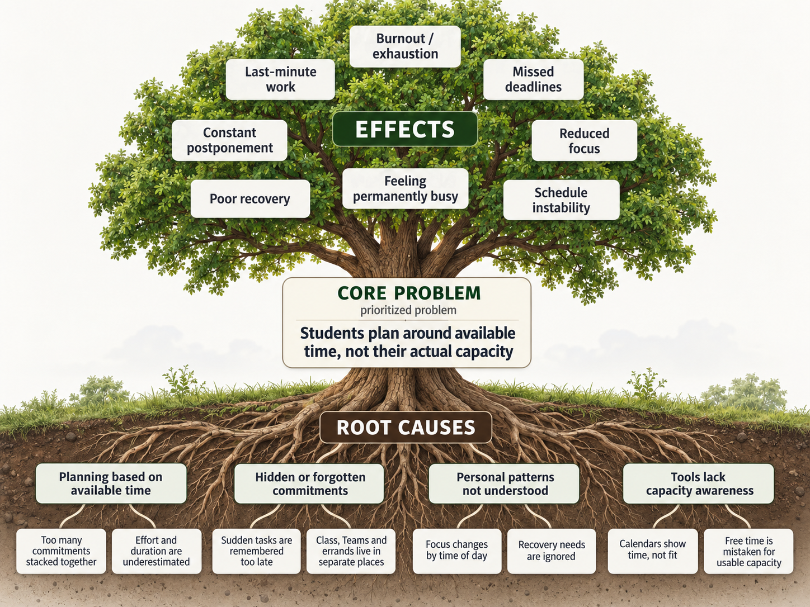
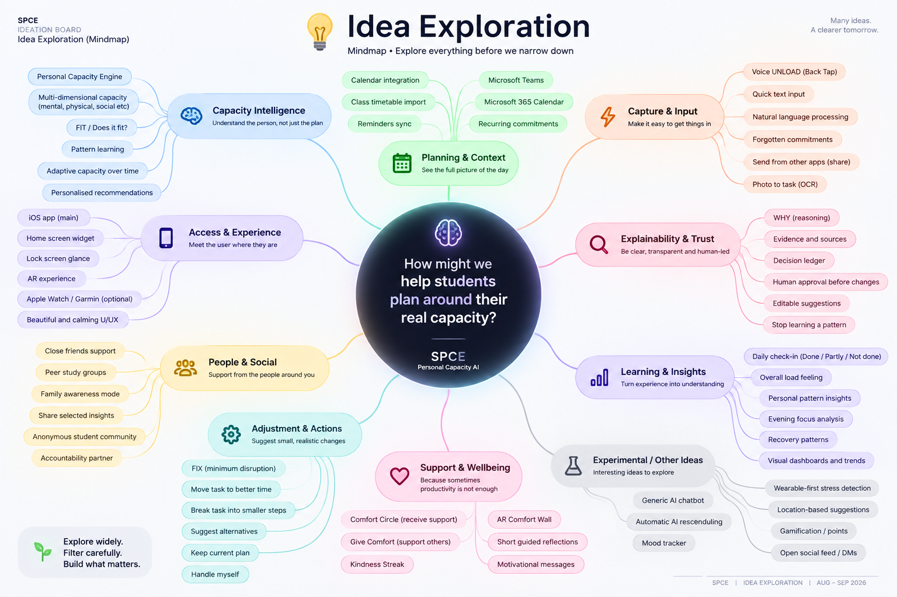
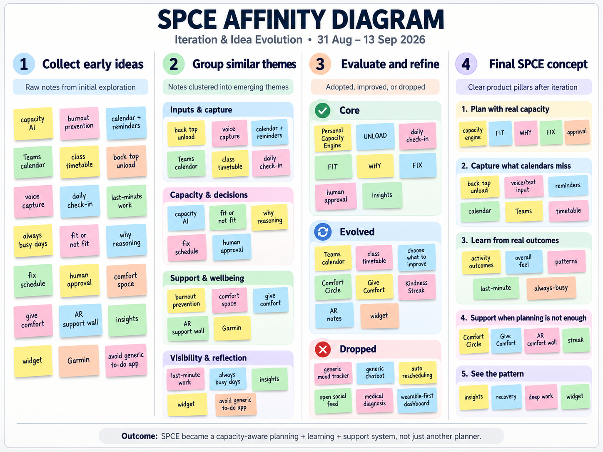
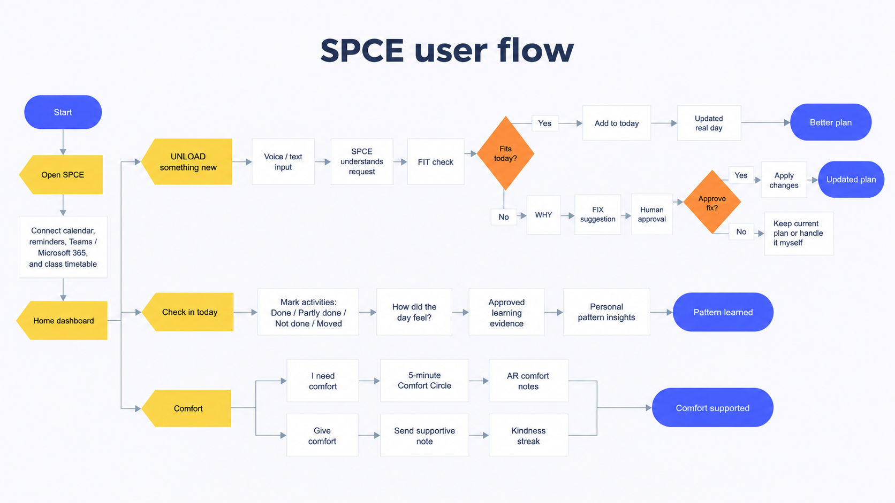
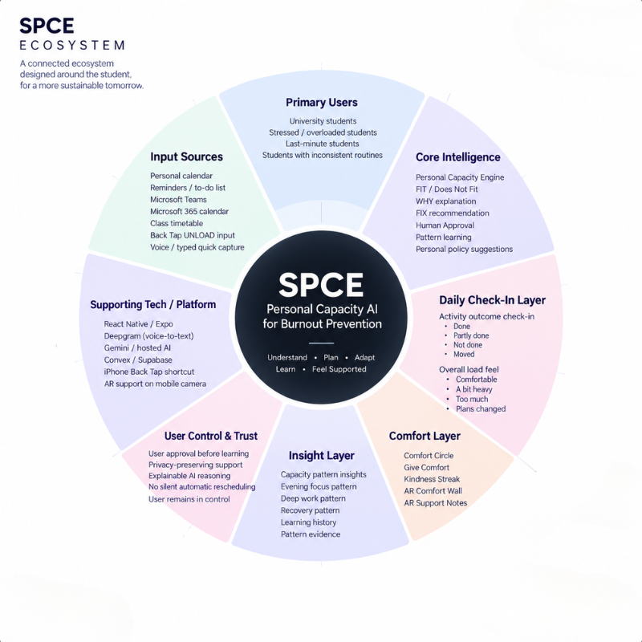
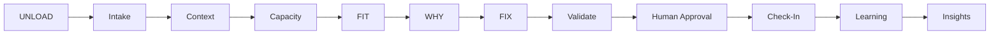

  

<h1 align="center">SPCE : Personal Capacity AI That Learns Your Patterns</h1>

  <strong>SPCE gets to know you like someone who loves you would : learning when you can handle more, when you need to slow down, when you are falling into a last-minute pattern, and when you just need comfort.</strong>

  <em>Free time is not the same as capacity.</em>

  
  
  
  
  

---

| | |
| --- | --- |
| **Team** | [Member 1], [Member 2], [Member 3], [Member 4] |
| **Problem Statement** | Stress & Workload Manager |
| **Video Presentation** | [Unlisted YouTube Link] |
| **Presentation Slides** | [Public Link] |
| **UI Prototype** | [Public Figma Link] |

---

 

#  1. Project Overview

##  1.1 The Problem

**Imagine this:** your bestie keeps telling you uni life is exhausting. Assignments are piling up, classes are scattered across the day, Teams meetings keep appearing, they are commuting, running errands, keeping up with friends, and somehow still expected to stay productive.

Then you check their calendar and say:

> **“But bestie… you’re free at 7 PM?”**

**That is exactly the problem: free time ≠ real capacity.**

A “free” hour can still come after **📚 classes, 🚌 commuting, 🛒 errands, 👥 social commitments, 🧠 mental load, and 😮‍💨 trying to recover**. A timetable can show an empty slot without showing whether the person living through that day can realistically handle another demanding task.

> **This is not a small problem.** In a 2025 UPM study of **1,211 higher-education students**, **60.5% reported symptoms of anxiety, 45.6% depression, and 40% stress**. *The Star* also highlighted academic pressure, career uncertainty, and financial constraints as contributors to student stress and burnout. [[1]](https://www.thestar.com.my/news/nation/2025/06/16/heavy-price-of-education)

Existing tools already help organise the day, but SPCE focuses on what those plans demand from the person:

<table>
  <thead>
    <tr>
      <th align="center">App</th>
      <th align="left">What it helps with</th>
      <th align="left">Core question</th>
    </tr>
  </thead>
  <tbody>
    <tr>
      <td align="center">
         
        <strong>Akiflow</strong>
      </td>
      <td>Tasks, calendars and time-blocking.</td>
      <td><strong>“When should I do this?”</strong></td>
    </tr>
    <tr>
      <td align="center">
         
        <strong>Tiimo</strong>
      </td>
      <td>Visual planning, routines and daily structure.</td>
      <td><strong>“What do I need to do?”</strong></td>
    </tr>
    <tr>
      <td align="center">
         
        <strong>SPCE</strong>
      </td>
      <td>Hidden workload, behavioural patterns and personal capacity.</td>
      <td><strong>“Even if I have time, can I actually handle this right now?”</strong></td>
    </tr>
  </tbody>
</table>

> **SPCE’s gap:** planning the day is not the same as understanding the person living through it.

  <strong>🧠 Mental &nbsp;·&nbsp; ⏱️ Time &nbsp;·&nbsp; ⚡ Physical &nbsp;·&nbsp; 👥 Social &nbsp;·&nbsp; 🛍️ Errands</strong>

> [!NOTE]
> **SPCE is a stress and workload management tool, not a medical diagnosis tool.**

  

##  1.2 Our Solution

  <strong>SPCE learns how much you can realistically handle each day, not just what fits on your calendar.</strong>

  A human-governed Personal Capacity AI that learns your personalized behaviour patterns through specialist agents and governed self-learning.

 

###  What SPCE brings together

<table>
<tr>

<td width="20%" align="center">
   
  <strong>Your Real Day</strong> 
  Calendar · Reminders · Teams · Timetable · UNLOAD
</td>

<td width="20%" align="center">
   
  <strong>Personal Capacity</strong> 
  Time · Mental · Physical · Social · Errands
</td>

<td width="20%" align="center">
   
  <strong>Personalized Behaviour Patterns</strong> 
  Focus · Recovery · Last-minute work · Always-busy days
</td>

<td width="20%" align="center">
   
  <strong>Specialist Agents</strong> 
  FIT · WHY · FIX · Learning · Insights
</td>

<td width="20%" align="center">
   
  <strong>Governed Learning</strong> 
  Only approved evidence changes future guidance
</td>

</tr>
</table>

 

###  The SPCE Loop

<table>
<tr>

<td align="center" width="14%">
   
  <strong>UNLOAD</strong> 
  Capture hidden work
</td>

<td align="center" width="14%">
   
  <strong>FIT</strong> 
  Can I handle it?
</td>

<td align="center" width="14%">
   
  <strong>WHY</strong> 
  Show the evidence
</td>

<td align="center" width="14%">
   
  <strong>FIX</strong> 
  Smallest useful change
</td>

<td align="center" width="14%">
   
  <strong>APPROVE</strong> 
  You stay in control
</td>

<td align="center" width="14%">
   
  <strong>CHECK-IN</strong> 
  Record what happened
</td>

<td align="center" width="16%">
   
  <strong>LEARN</strong> 
  Use approved outcomes
</td>

</tr>
</table>

  <strong>LangGraph</strong> coordinates the specialist agents through one shared SPCE state.

 

###  What SPCE can notice

<table>
<tr>
<td width="50%">
  
  <strong>Last-minute work</strong> 
  Repeated late starts and deadline pressure
</td>
<td width="50%">
  
  <strong>Always-busy days</strong> 
  Too many commitments stacked together
</td>
</tr>

<tr>
<td>
  
  <strong>Forgotten commitments</strong> 
  Tasks and errands that never reached the calendar
</td>
<td>
  
  <strong>Underestimated work</strong> 
  Tasks repeatedly taking longer than planned
</td>
</tr>

<tr>
<td>
  
  <strong>Evening focus</strong> 
  When demanding work tends to become harder
</td>
<td>
  
  <strong>Recovery patterns</strong> 
  When repeated heavy days need lighter space
</td>
</tr>
</table>

> SPCE does not label the user. It shows the pattern, the evidence behind it, and lets the user decide whether it should influence future guidance.

 

###  Governed Self-Learning

<table>
<tr>

<td width="25%" align="center">
   
  <strong>Observe</strong> 
  Done · Partly done · Not done · Moved
</td>

<td width="25%" align="center">
   
  <strong>Feel</strong> 
  Comfortable · Heavy · Too much · Plans changed
</td>

<td width="25%" align="center">
   
  <strong>Propose</strong> 
  SPCE surfaces a repeated pattern
</td>

<td width="25%" align="center">
   
  <strong>Approve</strong> 
  You decide what SPCE is allowed to learn
</td>

</tr>
</table>

> **No silent learning. No hidden personal policy changes.**

 

###  What if Planning Is Not Enough?

  Sometimes the user does not need another productivity suggestion. They need support.

<table>
<tr>

<td width="25%" align="center">
   
  <strong>Comfort Circle</strong> 
  Private 5-minute support
</td>

<td width="25%" align="center">
   
  <strong>Give Comfort</strong> 
  Send one short supportive note
</td>

<td width="25%" align="center">
   
  <strong>Kindness Streak</strong> 
  Build a daily habit of supporting others
</td>

<td width="25%" align="center">
   
  <strong>Augmented Reality (AR) Comfort Wall</strong> 
  See supportive notes around you, not in another inbox
</td>

</tr>
</table>

 

###  SPCE in One Line

  <strong>SPCE stops your calendar from gaslighting you. It learns what you can actually handle, explains why something does or does not fit, suggests the smallest fix, and knows when the answer is comfort, not more hustle.</strong>

---

 

#  2. Ideation & Process

##  2.1 Ideation Boards

We used five visual boards to document the ideation process from **understanding the problem**, to **exploring possibilities**, **clustering and refining ideas**, **mapping the user journey**, and finally **defining the SPCE ecosystem**.

 

#### 1. Problem Tree

  

<strong>What it shows:</strong> The root causes behind student overload, the central problem that students plan around available time rather than actual capacity, and the resulting effects such as burnout, last-minute work, missed deadlines, poor recovery, reduced focus, and schedule instability.

 

#### 2. Idea Exploration Mindmap

  

<strong>What it shows:</strong> A broad exploration of possible directions across capacity intelligence, planning context, capture and input, explainability, learning, support, adjustments, access, and experimental ideas before the concept was narrowed.

 

#### 3. Affinity Diagram

  

<strong>What it shows:</strong> Raw ideas grouped into common themes, then evaluated as core, evolved, or dropped. The clustering process helped turn a broad set of possibilities into the final SPCE product pillars.

 

#### 4. SPCE User Flow

  

<strong>What it shows:</strong> The end-to-end user journey from real-day context and UNLOAD, through FIT, WHY, FIX and Human Approval, then into daily check-in, approved learning, Personal Pattern Insights, and the Comfort experience.

 

#### 5. SPCE Ecosystem

  

<strong>What it shows:</strong> The final SPCE ecosystem connecting primary users, input sources, the Personal Capacity Engine, daily check-ins, Comfort, Insights, user control, and the supporting technologies that enable the experience.

> **Our ideation path:** 🌳 understand the problem · 🧠 explore widely · 🗂️ cluster and refine · 🧭 map the experience · 🌐 connect the ecosystem

  

  

##  2.2 Iteration & Idea Evolution

SPCE evolved through multiple documented iterations from **31 Aug to 13 Sep 2026**. Each iteration tested a different answer to one question: **how can we help a student understand what they can realistically handle while keeping them in control?**

| Date | Iteration | Direction Explored | Learning | Decision | Evolution |
|---|---|---|---|---|---|
| **📅 31 Aug** | **01 · 🌡️ Stress & Mood** | Mood tracker, burnout indicators, wearable-first stress dashboard, medical-style interpretation | Mood or stress data alone could not explain **why work did not fit**. Medical interpretation also pushed SPCE too close to diagnosis. | **❌ Dropped** | 🧠 Shifted toward **personal capacity, workload fit, and behaviour patterns**. |
| **📅 1 Sep** | **02 · 📆 Smarter Planner** | To-do list, calendar, reminders, timetable, Teams / Microsoft 365 connection | A better calendar still answers **what is scheduled**, not **whether the student can realistically handle it**. | **🟡 Partly Kept** | 🔗 Calendar, reminders, timetable, and Teams became **inputs to SPCE**, not the product itself. |
| **📅 3 Sep** | **03 · 🤖 AI Scheduling** | Generic AI chatbot and automatic AI rescheduling | Chat alone could become vague, while automatic rescheduling reduced control and made decisions difficult to inspect. | **🔄 Pivoted** | 🧩 Created the structured **FIT, WHY, FIX, Human Approval** model, later organised as bounded specialist agents coordinated by **LangGraph**. |
| **📅 4 Sep** | **04 · 🧠 Capacity Engine** | Learn from planned commitments, actual outcomes, postponements, and overall load | The gap between **planned and actual behaviour** was more useful than a static productivity score. | **✅ Adopted** | 📚 Added **Activity Check-In, Overall Load Check-In, capacity learning, and personal policies**. |
| **📅 6 Sep** | **05 · ⚡ Instant UNLOAD** | Fast capture for sudden or forgotten commitments, including iPhone Back Tap | Important work is often remembered **outside the calendar**, after the original plan is already made. | **✅ Adopted** | 🎙️ UNLOAD became the fast capture layer for new commitments before SPCE checks capacity. |
| **📅 8 Sep** | **06 · 📊 Pattern Guidance** | Personal Pattern Insights, focus windows, recovery patterns, last-minute behaviour, always-busy days | Capacity is personal. Repeated behaviour reveals patterns that a generic planner misses. | **✨ Expanded** | 🔍 Added **Insights, pattern visualisation, and Choose What to Improve**. |
| **📅 10 Sep** | **07 · 💬 Social Support** | Open social feed, DMs, peer support, and gamification | A full social network created distraction and privacy concerns, but short supportive interactions still had value. | **🔄 Pivoted** | 💜 Dropped the open feed and DMs. Added **Comfort Circle, Give Comfort, and Kindness Streak**. |
| **📅 12 Sep** | **08 · 🪄 Spatial Comfort** | Make supportive messages more memorable than another inbox or notification | Support felt more meaningful when it appeared in the user’s environment. | **✨ Improved** | 🥽 Added **AR Comfort Wall / AR Notes** using spatial sticky notes on a wall or desk. |
| **📅 13 Sep** | **09 · 📱 Glanceable Context** | Home-screen capacity widget and optional Garmin context | Quick context is useful without opening the app, but SPCE should not depend on a wearable. | **🧪 Stretch** | 👀 Kept the **Capacity Widget** as a lightweight extension and Garmin as optional context only. |

> **🧭 Evolution summary:** SPCE began closer to a stress and productivity tool, then became a **Personal Capacity AI** centered on real-day context, explainable decision support, human approval, personal pattern learning, and focused peer comfort.

  

##  2.3 Mentor Consultation

We used the mentoring sessions to decide what to **adopt**, what to **pivot**, and what to **improve further**.

 

#### Session 1: Buildability

| Detail | Information |
|---|---|
| **Date** | 7 Sep 2026 |
| **Time** | 11:25 PM |
| **Mentor** | **Sim Hong Bing** |

| Focus | Mentor Feedback | Decision | What Changed in SPCE |
|---|---|---|---|
| **Hackathon scope** | Keep the **Personal Capacity AI** concept practical and realistic for the build phase. | **Adopted** | Narrowed SPCE around the core capacity loop instead of trying to solve everything at once. |
| **Tech stack** | Recommended **React Native**, **Deepgram**, hosted AI, and managed services such as **Convex / Supabase**. | **Adopted** | Moved toward a faster managed stack suitable for the hackathon. |
| **AI architecture** | Use hosted AI pragmatically instead of overcomplicating the build. | **Pivoted** | Added **LangGraph** as the orchestration layer. Specialist agents handle understanding, FIT, WHY, FIX, learning, and Insights, while deterministic tools and Human Approval keep the workflow structured and explainable. |
| **Deployment** | Flagged iOS deployment friction and suggested **Android / PWA** as fallbacks. | **Kept + Fallback** | Remained iOS-first because Back Tap UNLOAD is part of the experience, with Android/PWA as fallback options. |

 

#### Session 2: Differentiation

| Detail | Information |
|---|---|
| **Date** | 11 Sep 2026 |
| **Time** | 11:25 PM |
| **Mentor** | **Sim Hong Bing** |

| Focus | Mentor Feedback | Decision | What Changed in SPCE |
|---|---|---|---|
| **Differentiation** | The prototype was useful but could still feel like another productivity app. | **Pivoted** | Shifted differentiation toward **Personal Pattern Insights** and capacity-aware reasoning. |
| **Why now?** | Make SPCE more memorable and clearly show why the product matters now. | **Improved** | Strengthened **WHY, Insights, and Human Approval** so the intelligence is visible and explainable. |
| **Experience** | Explore realtime AI, generated visuals, gamification, bots, avatars, or unconventional interaction. | **Adapted** | Added **Comfort Circle, Give Comfort + Kindness Streak, and the AR Comfort Wall** instead of turning SPCE into a generic chatbot or gamified calendar. |

> **Mentor impact:** Session 1 made SPCE **more buildable**. Session 2 made it **more distinctive and memorable** without losing the core Personal Capacity AI idea.

---

 

#  3. Design & Prototype

**UI Prototype:** [Public Figma Link]

SPCE is designed as **one continuous, playable mobile experience** : not a collection of disconnected screens.

  

## Primary Navigation

| Area | Purpose |
|---|---|
| 🏠 **Home** | See today’s capacity, commitments, UNLOAD, and start a daily check-in |
| 💼 **Work** | Plan the real day through **UNLOAD › FIT › WHY › FIX › Approval** |
| 💜 **Comfort** | Receive or give support through Comfort Circle, AR Notes, and Kindness Streak |
| 📊 **Insights** | Understand capacity, focus, recovery, and learned personal patterns |

  

## Core Prototype Journeys

| Journey | Flow |
|---|---|
| 💼 **Planning** | Real Day › UNLOAD › FIT › WHY › FIX › Human Approval › Confirmation |
| 🧠 **Daily Learning** | Check in today › Activity outcomes › Overall feel › Review › Approved learning |
| 💜 **Receive Comfort** | I need comfort › 5-minute Circle › Live session › AR setup › AR comfort notes |
| 🤝 **Give Comfort** | Give comfort › Send note › Comfort sent › Kindness Streak |
| 📊 **Insights** | 7-day capacity pattern › Pattern detail › Evidence › What it affects |

> The planning flow handles **what should happen next**.  
> The later check-in records **what actually happened and how the day felt**.

  

##  Prototype Mockups

<table>
<tr>
<td align="center" width="25%">
   
  <strong>Home</strong> 
  See what fits today before overload starts.
</td>
<td align="center" width="25%">
   
  <strong>Real Day</strong> 
  Bring events, reminders, and real commitments together.
</td>
<td align="center" width="25%">
   
  <strong>UNLOAD</strong> 
  Capture what calendars usually miss.
</td>
<td align="center" width="25%">
   
  <strong>FIX</strong> 
  Make the smallest practical change that helps.
</td>
</tr>

<tr>
<td align="center" width="25%">
   
  <strong>Insights</strong> 
  Turn daily outcomes into personal capacity patterns.
</td>
<td align="center" width="25%">
   
  <strong>Comfort Circle</strong> 
  Open a private five-minute support space.
</td>
<td align="center" width="25%">
   
  <strong>AR Comfort</strong> 
  See supportive notes around you in AR.
</td>
<td align="center" width="25%">
   
  <strong>Kindness Streak</strong> 
  Give comfort and keep small acts of kindness going.
</td>
</tr>

<tr>
<td align="center" colspan="4">
   
  <strong>Widget</strong> 
  See today’s capacity and UNLOAD at a glance.
</td>
</tr>
</table>

---

 

#  4. What Makes It Different

SPCE is not trying to become another task manager. Its main difference is that it learns from the gap between **what you planned**, **what actually happened**, and **how the load felt**.

  

##  4.1 Originality

  <strong>Most productivity tools ask: “When should I do this?”</strong> 
  <strong>SPCE asks: “Can I realistically handle this today, and what should the system learn from what actually happened?”</strong>

 

###  Where the originality comes from

<table>
<tr>
<td width="25%" align="center">
   
  <strong>Capacity-Aware Planning</strong> 
  Plans around real capacity, not just empty time
</td>
<td width="25%" align="center">
   
  <strong>Agentic Reasoning</strong> 
  LangGraph coordinates bounded specialist agents
</td>
<td width="25%" align="center">
   
  <strong>Governed Self-Learning</strong> 
  Learns from outcomes only through approved evidence
</td>
<td width="25%" align="center">
   
  <strong>Human + Support Layer</strong> 
  Human approval, Comfort Circle and AR support stay connected
</td>
</tr>
</table>

 

###  The SPCE closed loop

<table>
<tr>
<td align="center" width="14%">
   
  <strong>UNLOAD</strong> 
  Capture hidden load
</td>
<td align="center" width="14%">
   
  <strong>FIT</strong> 
  Check capacity
</td>
<td align="center" width="14%">
   
  <strong>WHY</strong> 
  Explain evidence
</td>
<td align="center" width="14%">
   
  <strong>FIX</strong> 
  Suggest smallest change
</td>
<td align="center" width="14%">
   
  <strong>APPROVE</strong> 
  User governs changes
</td>
<td align="center" width="14%">
   
  <strong>CHECK-IN</strong> 
  Record actual outcome
</td>
<td align="center" width="16%">
   
  <strong>LEARN</strong> 
  Update only from approved evidence
</td>
</tr>
</table>

  <strong>LangGraph</strong> coordinates the specialist agents while Human Approval and approved evidence govern what the system is allowed to learn.

 

###  What “governed self-learning” means

<table>
<thead>
<tr>
<th width="36%">Typical adaptive system</th>
<th width="64%">SPCE governed self-learning</th>
</tr>
</thead>
<tbody>
<tr>
<td>Learns silently from behaviour</td>
<td><strong>Uses explicit check-ins and approved outcomes as learning evidence</strong></td>
</tr>
<tr>
<td>Updates recommendations automatically</td>
<td><strong>Proposes a pattern first and lets the user approve, reject or stop using it</strong></td>
</tr>
<tr>
<td>Hides why the model changed</td>
<td><strong>Keeps evidence, reasoning and decisions inspectable through WHY, Insights and the Decision Ledger</strong></td>
</tr>
<tr>
<td>Treats unusual days as normal data</td>
<td><strong>“Plans changed” prevents abnormal days from becoming clean capacity evidence</strong></td>
</tr>
<tr>
<td>Optimises for completion</td>
<td><strong>Learns both what was completed and how heavy the workload felt</strong></td>
</tr>
</tbody>
</table>

 

###  Why SPCE is different

<table>
<thead>
<tr>
<th width="36%">Typical productivity app</th>
<th width="64%">SPCE</th>
</tr>
</thead>
<tbody>
<tr>
<td>Finds an empty time slot</td>
<td><strong>Checks whether the person still has capacity</strong></td>
</tr>
<tr>
<td>One general AI assistant</td>
<td><strong>LangGraph specialist agents for FIT, WHY, FIX, Learning and Insights</strong></td>
</tr>
<tr>
<td>Automatically rearranges tasks</td>
<td><strong>Explains, proposes a minimum-disruption FIX, then waits for approval</strong></td>
</tr>
<tr>
<td>Tracks productivity</td>
<td><strong>Builds a governed personal capacity model from planned vs actual outcomes</strong></td>
</tr>
<tr>
<td>Learns in the background</td>
<td><strong>Learning is visible, evidence-based and user-governed</strong></td>
</tr>
<tr>
<td>Treats wellbeing as separate</td>
<td><strong>Connects capacity planning, self-learning and Comfort in one experience</strong></td>
</tr>
</tbody>
</table>

> **Originality:** SPCE combines capacity-aware planning, LangGraph specialist agents, explainable recommendations, **governed self-learning**, human approval, and spatial peer support into one Personal Capacity AI.

  

##  4.2 Novel Features

| **Feature** | **What makes it different** |
| --- | --- |
| ⚡ **Instant UNLOAD** | Back Tap + voice/text captures invisible commitments before the user forgets them. |
| 🔗 **One real-day context** | SPCE can combine calendar, reminders, Teams / Microsoft 365 commitments, class timetable and UNLOAD instead of treating one calendar as the whole truth. |
| 🎯 **Choose what to improve** | A student can start with the pattern they care about, including last-minute work, always-busy days, forgotten commitments or recovery. |
| 🧠 **Personal Capacity Learning** | Capacity is learned from the user’s own outcomes rather than a generic productivity target. |
| ✅ **Activity-level outcomes** | SPCE distinguishes Done, Partly done, Not done and Moved instead of only asking whether the day was “good” or “bad.” |
| 🌡️ **Outcome feel** | Completion is separated from perceived load: Comfortable, A bit heavy, Too much or Plans changed. |
| 🕸️ **Specialist Agent Orchestration** | **LangGraph** coordinates bounded agents for Context, Capacity, FIT, WHY, FIX, Learning, and Insights using one shared state. |
| 🔍 **WHY Agent** | Explains the evidence behind an important recommendation instead of making the user trust a hidden result. |
| 🙋 **Human approval first** | The graph pauses at an approval gate so the user can approve, reject, or edit before schedule changes or learning are committed. |
| 🛠️ **FIX Agent** | Generates minimum-disruption options, then passes them through constraints and approval instead of silently rearranging the day. |
| 💜 **Comfort Circle** | A private five-minute support session gives encouragement without exposing schedule or identity. |
| 🪄 **AR Support Wall** | Comfort notes appear as floating spatial sticky notes on a nearby wall or desk rather than an inbox. |
| 🔥 **Kindness Streak** | Users can give one meaningful supportive message and build a daily streak without encouraging spam. |
| 📊 **Pattern visualisation** | Insights shows capacity, focus, deep-work and recovery patterns instead of reducing the person to one score. |
| 🧩 **Pattern controls** | Users can inspect what a pattern affects and stop SPCE from using it. |

> **The SPCE idea in one line:** learn the person behind the calendar, help them improve the pattern that gets in the way, keep the AI explainable, keep the human in control, and make support part of the experience.

  

##  4.3 Market Positioning

SPCE is positioned as a **capacity-aware planning and governed self-learning system** for students, not a generic planner.

<table>
<thead>
<tr>
<th align="left">Capability</th>
<th align="center">
   
  <strong>SPCE</strong>
</th>
<th align="center">
   
  <strong>Akiflow</strong>
</th>
<th align="center">
   
  <strong>Tiimo</strong>
</th>
</tr>
</thead>
<tbody>

<tr>
<td><strong>Task / calendar planning</strong></td>
<td align="center">
   
  Capacity-aware planning
</td>
<td align="center">
   
  Scheduling / time blocking
</td>
<td align="center">
   
  Visual planning
</td>
</tr>

<tr>
<td><strong>Multi-source student context</strong></td>
<td align="center">
   
  Calendar + Reminders + Teams / Timetable
</td>
<td align="center">
   
  Calendar integrations
</td>
<td align="center">
   
  Calendar / planning integrations
</td>
</tr>

<tr>
<td><strong>Fast invisible-commitment capture</strong></td>
<td align="center">
   
  Back Tap + voice/text UNLOAD
</td>
<td align="center">
   
  Inbox + shortcuts
</td>
<td align="center">
   
  Quick planning tools
</td>
</tr>

<tr>
<td><strong>Daily activity outcome check-in</strong></td>
<td align="center">
   
  Done / Partly done / Not done / Moved
</td>
<td align="center">
   
  Review / stats
</td>
<td align="center">
   
  Daily review
</td>
</tr>

<tr>
<td><strong>Personal capacity model</strong></td>
<td align="center">
   
  Five capacity dimensions + history
</td>
<td align="center">
   
  Not a core model
</td>
<td align="center">
   
  Wellbeing + planning
</td>
</tr>

<tr>
<td><strong>Last-minute / always-busy pattern focus</strong></td>
<td align="center">
   
  Improvement goal + learned evidence
</td>
<td align="center">
   
  No pattern-learning focus
</td>
<td align="center">
   
  Flexible routine support
</td>
</tr>

<tr>
<td><strong>Explains why something does not fit</strong></td>
<td align="center">
   
  WHY Agent + Decision Ledger
</td>
<td align="center">
   
  No capacity explanation layer
</td>
<td align="center">
   
  No capacity explanation layer
</td>
</tr>

<tr>
<td><strong>Governed self-learning</strong></td>
<td align="center">
   
  Approved outcomes + visible pattern updates
</td>
<td align="center">
   
  No governed learning loop
</td>
<td align="center">
   
  No governed learning loop
</td>
</tr>

<tr>
<td><strong>Human approval before learning policy</strong></td>
<td align="center">
   
  Explicit approval gate
</td>
<td align="center">
   
  No approval gate
</td>
<td align="center">
   
  No approval gate
</td>
</tr>

<tr>
<td><strong>Smallest workload fix</strong></td>
<td align="center">
   
  FIX Agent + minimum disruption
</td>
<td align="center">
   
  Rescheduling
</td>
<td align="center">
   
  Reshuffling
</td>
</tr>

<tr>
<td><strong>Private peer support</strong></td>
<td align="center">
   
  Comfort Circle
</td>
<td align="center">
   
  Not core
</td>
<td align="center">
   
  Not core
</td>
</tr>

<tr>
<td><strong>AR comfort message experience</strong></td>
<td align="center">
   
  AR Comfort Wall
</td>
<td align="center">
   
  Not offered
</td>
<td align="center">
   
  Not offered
</td>
</tr>

<tr>
<td><strong>Capacity pattern visualisation</strong></td>
<td align="center">
   
  Insights Agent + evidence
</td>
<td align="center">
   
  Productivity stats
</td>
<td align="center">
   
  Planning / wellbeing views
</td>
</tr>

</tbody>
</table>

<table>
<tr>
<td>
  
  <strong>Core strength</strong>
</td>
<td>
  
  <strong>Partial / limited</strong>
</td>
<td>
  
  <strong>Not offered</strong>
</td>
</tr>
</table>

> **Positioning summary:** SPCE stands apart by combining **capacity-aware planning**, **LangGraph agent orchestration**, **governed self-learning**, **human approval**, and **Comfort Circle + AR support** into one student-centered system.

---

 

#  5. Technical Architecture & Feasibility

  <strong>Build the core loop first. Keep the agents bounded. Use managed infrastructure. Protect human control.</strong>

  

##  5.1 Tech Stack at a Glance

<table>
<thead>
<tr>
<th align="left">Layer</th>
<th align="left">Stack</th>
<th align="left">Purpose</th>
</tr>
</thead>
<tbody>

<tr>
<td><strong>Mobile</strong></td>
<td>
  
  <strong>React Native</strong>
  &nbsp;
  
  <strong>Expo</strong>
  &nbsp;
  
  <strong>TypeScript</strong>
</td>
<td>Fast iOS-first development</td>
</tr>

<tr>
<td><strong>Agent orchestration</strong></td>
<td>
  
  <strong>LangGraph</strong>
</td>
<td>Routes FIT, WHY, FIX, Learning and Insights agents</td>
</tr>

<tr>
<td><strong>Language model</strong></td>
<td>
  
  <strong>ILMU</strong>
</td>
<td>Understands input and supports bounded reasoning</td>
</tr>

<tr>
<td><strong>Voice</strong></td>
<td>
  
  <strong>Deepgram</strong>
</td>
<td>Speech-to-text for UNLOAD</td>
</tr>

<tr>
<td><strong>Backend</strong></td>
<td>
  
  <strong>Supabase</strong>
</td>
<td>Auth, Postgres and Realtime</td>
</tr>

<tr>
<td><strong>Secure edge</strong></td>
<td>
  
  <strong>Cloudflare Workers</strong>
</td>
<td>Protects service credentials and lightweight API logic</td>
</tr>

<tr>
<td><strong>Calendar context</strong></td>
<td>
  
  Apple Calendar / Reminders
  &nbsp;
  
  <strong>Microsoft 365 / Teams</strong>
</td>
<td>Builds the user's real-day context</td>
</tr>

<tr>
<td><strong>AR support</strong></td>
<td>
  
  <strong>Mobile AR surface detection</strong>
</td>
<td>Places Comfort notes on a wall or desk</td>
</tr>

<tr>
<td><strong>Build & distribution</strong></td>
<td>
  
  <strong>Expo EAS / TestFlight</strong>
</td>
<td>Installable iOS prototype</td>
</tr>

</tbody>
</table>

  

##  5.2 Specialist Agent System

<table>
<tr>
<td width="20%" align="center">
   
  <strong>Intake</strong> 
  Structure UNLOAD
</td>
<td width="20%" align="center">
   
  <strong>Context</strong> 
  Build the real day
</td>
<td width="20%" align="center">
   
  <strong>Capacity</strong> 
  Prepare capacity evidence
</td>
<td width="20%" align="center">
   
  <strong>FIT</strong> 
  Does it fit?
</td>
<td width="20%" align="center">
   
  <strong>WHY</strong> 
  Explain the evidence
</td>
</tr>

<tr>
<td width="20%" align="center">
   
  <strong>FIX</strong> 
  Suggest the smallest change
</td>
<td width="20%" align="center">
   
  <strong>Validate</strong> 
  Check constraints
</td>
<td width="20%" align="center">
   
  <strong>Approve</strong> 
  User decides
</td>
<td width="20%" align="center">
   
  <strong>Learning</strong> 
  Use approved outcomes
</td>
<td width="20%" align="center">
   
  <strong>Insights</strong> 
  Surface patterns
</td>
</tr>
</table>

  <strong>LangGraph</strong> coordinates one shared SPCE state across bounded specialist agents.

 

#### Governed flow

  

##  5.3 Governance at a Glance

<table>
<tr>
<td width="20%" align="center">
   
  <strong>Visible WHY</strong> 
  Reasoning stays inspectable
</td>
<td width="20%" align="center">
   
  <strong>Bounded FIX</strong> 
  Suggest, never silently change
</td>
<td width="20%" align="center">
   
  <strong>Human Approval</strong> 
  Important changes pause
</td>
<td width="20%" align="center">
   
  <strong>Governed Learning</strong> 
  Approved evidence only
</td>
<td width="20%" align="center">
   
  <strong>Decision Trace</strong> 
  See what changed and why
</td>
</tr>
</table>

> **ILMU understands · LangGraph orchestrates · deterministic tools verify · humans approve · approved outcomes teach the system**

  

##  5.4 System Architecture

  

<table>
<tr>
<td align="center"><strong>Inputs</strong> Voice · Calendar · Reminders · Teams · Timetable</td>
<td align="center"><strong>LangGraph</strong> State · Routing · Approval pause</td>
<td align="center"><strong>Agents</strong> Capacity · FIT · WHY · FIX · Learning</td>
<td align="center"><strong>Tools</strong> Rules · Constraints · Policies</td>
<td align="center"><strong>Outputs</strong> Plan · Insights · Comfort</td>
</tr>
</table>

  

##  5.5 Build Plan

<table>
<tr>
<td width="33%" valign="top">
  

     
    <strong>21 to 27 Sep</strong> 
    PHASE 01
  

  <strong>Foundation</strong>  
  App setup 
  Supabase 
  Deepgram 
  ILMU adapter 
  LangGraph state 
  Intake + Context
</td>

<td width="33%" valign="top">
  

     
    <strong>28 Sep to 4 Oct</strong> 
    PHASE 02
  

  <strong>Core Intelligence</strong>  
  Capacity Agent 
  FIT Agent 
  WHY Agent 
  FIX Agent 
  Validator 
  Human Approval
</td>

<td width="33%" valign="top">
  

     
    <strong>5 to 11 Oct</strong> 
    PHASE 03
  

  <strong>Learning + Support</strong>  
  Check-In 
  Learning Agent 
  Insights Agent 
  Comfort Circle 
  AR Wall 
  Final polish
</td>
</tr>
</table>

 

#### Priority map

<table>
<tr>
<td width="33%" align="center">
   
  <strong>P0 · Must Ship</strong> 
  UNLOAD · FIT · WHY · FIX · Approval · Check-In · Learning · Insights
</td>
<td width="33%" align="center">
   
  <strong>P1 · Should Ship</strong> 
  Comfort Circle · Give Comfort · Kindness Streak · AR Wall
</td>
<td width="33%" align="center">
   
  <strong>P2 · Stretch</strong> 
  Widget · Garmin · richer AR · deeper integrations
</td>
</tr>
</table>

  

##  5.6 Feasibility Snapshot

<table>
<thead>
<tr>
<th align="left">Area</th>
<th align="center">Status</th>
<th align="left">Why</th>
</tr>
</thead>
<tbody>
<tr>
<td><strong>Tech stack</strong></td>
<td align="center"></td>
<td>Managed, practical tools</td>
</tr>
<tr>
<td><strong>Scope</strong></td>
<td align="center"></td>
<td>Clear P0 / P1 / P2 boundary</td>
</tr>
<tr>
<td><strong>Agent architecture</strong></td>
<td align="center"></td>
<td>Bounded agents, shared state</td>
</tr>
<tr>
<td><strong>Governance</strong></td>
<td align="center"></td>
<td>Human approval + visible learning</td>
</tr>
<tr>
<td><strong>AR</strong></td>
<td align="center"></td>
<td>Limited to one wall / desk prototype</td>
</tr>
<tr>
<td><strong>Garmin / deeper connectors</strong></td>
<td align="center"></td>
<td>Not required for the core demo</td>
</tr>
</tbody>
</table>

  

##  5.7 Resources & Constraints

<table>
<tr>
<td width="25%" align="center">
   
  <strong>Time</strong> 
  3 focused build phases
</td>
<td width="25%" align="center">
   
  <strong>Team</strong> 
  Mobile · AI · backend · testing
</td>
<td width="25%" align="center">
   
  <strong>Cost</strong> 
  Free / student / low-usage tiers
</td>
<td width="25%" align="center">
   
  <strong>Infrastructure</strong> 
  No custom model training
</td>
</tr>
</table>

 

#### Fallbacks

| **Risk** | **Fallback** | **Core loop affected?** |
| --- | --- | --- |
| Teams / timetable integration | Seeded academic schedule | No |
| Voice input | Typed UNLOAD | No |
| AR polish | Simpler anchored-note demo | No |
| Garmin | Remove from build | No |
| Realtime Comfort | Controlled demo flow | No |

> **Priority rule:** if time becomes constrained, protect **UNLOAD · FIT · WHY · FIX · Human Approval · Check-In · Learning · Insights** first.

  

##  5.8 Definition of Done

<table>
<tr>
<td width="25%" align="center">
   
  <strong>Capture</strong> 
  UNLOAD becomes structured input
</td>
<td width="25%" align="center">
   
  <strong>Decide</strong> 
  FIT returns a result
</td>
<td width="25%" align="center">
   
  <strong>Explain</strong> 
  WHY shows evidence
</td>
<td width="25%" align="center">
   
  <strong>Adjust</strong> 
  FIX proposes the smallest change
</td>
</tr>

<tr>
<td width="25%" align="center">
   
  <strong>Approve</strong> 
  User can approve, reject or edit
</td>
<td width="25%" align="center">
   
  <strong>Check-In</strong> 
  Actual outcome is recorded
</td>
<td width="25%" align="center">
   
  <strong>Learn</strong> 
  Approved evidence updates patterns
</td>
<td width="25%" align="center">
   
  <strong>Insights</strong> 
  Patterns become visible
</td>
</tr>
</table>

  

##  5.9 Scope Boundary

<table>
<tr>
<td width="50%" align="center">
   
  <strong>Core Capacity Loop</strong>  
  UNLOAD · Context · FIT · WHY · FIX · Approval · Check-In · Governed Learning · Insights
</td>
<td width="50%" align="center">
   
  <strong>Support Loop</strong>  
  Comfort Circle · Give Comfort · Kindness Streak · AR Comfort Wall
</td>
</tr>
</table>

> **Success means proving these two loops clearly, not building every possible SPCE feature.**

---

  <strong>Made with Love by EAQ 💜❤️</strong>

