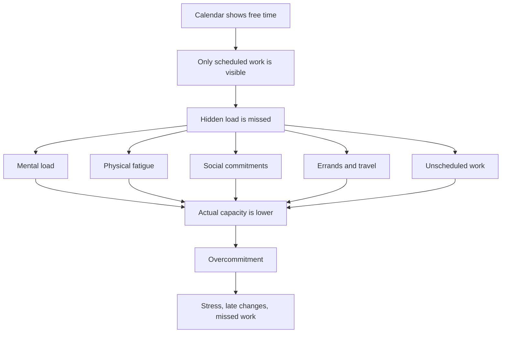
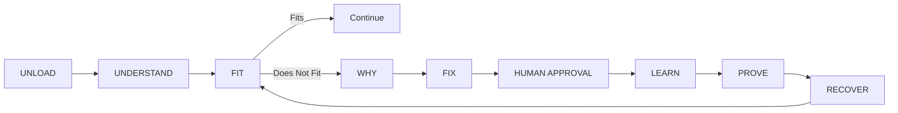
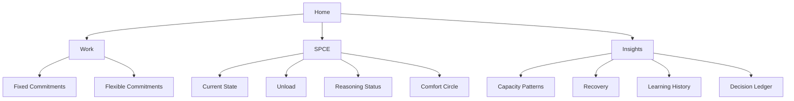
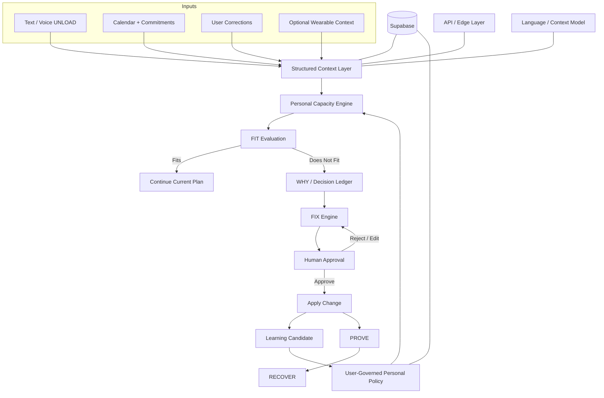

  

<h1 align="center">SPCE — Personal Capacity AI</h1>

  <strong>SPCE gets to know you like someone who loves you would — learning when you can handle more, when you need to slow down, and when you just need comfort.</strong>

  <em>Free time is not the same as capacity.</em>

  <a href="#-1-project-overview">Overview</a> •
  <a href="#-2-ideation--process">Ideation</a> •
  <a href="#-3-design--prototype">Prototype</a> •
  <a href="#-4-what-makes-it-different">Difference</a> •
  <a href="#-5-technical-architecture--feasibility">Architecture</a>

---

| | |
| --- | --- |
| **Team** | [Member 1], [Member 2], [Member 3], [Member 4] |
| **Problem Statement** | Stress & Workload Manager |
| **Video Presentation** | [Unlisted YouTube Link] |
| **Presentation Slides** | [Public Link] |
| **UI Prototype** | [Public Figma Link] |

---

##  1. Project Overview

### ⚠️ The Problem

**Imagine this:** your bestie keeps telling you uni life is exhausting. Assignments are piling up, they’re commuting, running errands, keeping up with friends, and somehow still expected to stay productive.

Then you check their calendar and say:

> **“But bestie… you’re free at 7 PM?”**

**That’s exactly the problem: free time ≠ real capacity.**

A “free” hour can still come after **📚 classes, 🚌 commuting, 🛒 errands, 👥 social commitments, 🧠 mental load, and 😮‍💨 trying to recover**. So even when there is time on the calendar, there may be very little capacity left to use it.

> **This is not a small problem.** In a 2025 UPM study of **1,211 higher-education students**, **60.5% reported symptoms of anxiety, 45.6% depression, and 40% stress**. *The Star* also highlighted academic pressure, career uncertainty, and financial constraints as contributors to student stress and burnout. [[1]](https://www.thestar.com.my/news/nation/2025/06/16/heavy-price-of-education)

Existing tools already help organise the day — but SPCE focuses on what those plans demand from the person:

<table>
  <thead>
    <tr>
      <th align="center">App</th>
      <th align="left">What it helps with</th>
      <th align="left">Core question</th>
    </tr>
  </thead>
  <tbody>
    <tr>
      <td align="center">
         
        <strong>Akiflow</strong>
      </td>
      <td>Tasks, calendars and time-blocking.</td>
      <td><strong>“When should I do this?”</strong></td>
    </tr>
    <tr>
      <td align="center">
         
        <strong>Tiimo</strong>
      </td>
      <td>Visual planning, routines and daily structure.</td>
      <td><strong>“What do I need to do?”</strong></td>
    </tr>
    <tr>
      <td align="center">
         
        <strong>SPCE</strong>
      </td>
      <td>Hidden workload and personal capacity.</td>
      <td><strong>“Even if I have time, can I actually handle this right now?”</strong></td>
    </tr>
  </tbody>
</table>

> **SPCE’s gap:** planning the day is not the same as understanding the person living through it.

  <strong>🧠 Mental &nbsp;·&nbsp; ⏱️ Time &nbsp;·&nbsp; ⚡ Physical &nbsp;·&nbsp; 👥 Social &nbsp;·&nbsp; 🛍️ Errands</strong>

> [!NOTE]
> **SPCE is a stress and workload management tool, not a medical diagnosis tool.**

###  Our Solution

> ## **SPCE learns how much you can realistically handle each day, not just what fits on your calendar.**

SPCE is a human-governed **Personal Capacity AI** that learns from what you actually complete, delay, postpone, or leave unfinished.

#### How SPCE works

| | **Step** | **What happens** |
| --- | --- | --- |
| ⚡ | **1. Capture fast** | Double-tap the back of your iPhone, then speak or type what you need to do. SPCE can also bring in commitments from connected **Calendar and Reminders**. |
| ✅ | **2. Check what actually happened** | SPCE checks in on what you completed, delayed, skipped, or postponed. |
| 🧠 | **3. Learn your capacity** | SPCE looks for patterns in what you realistically finish on different days and with different types of activities. |
| 🔍 | **4. Explain before deciding** | If SPCE thinks your day may be overloaded, it explains why and shows the pattern behind its suggestion. |
| 🙋 | **5. You approve** | You can approve, reject, or edit the suggestion before SPCE learns from it. |
| 💜 | **6. Get support when you need it** | **Comfort Space** gives stressed users a private place to receive short supportive messages from the community. |
| 🔥 | **7. Give support when you can** | Users can comfort someone else and build a **Kindness Streak** through positive support. |

#### 🧠 What does “learning your capacity” mean?

SPCE compares what you **planned** with what you actually **managed to finish**.

> 💡 **Example:** You planned **6 commitments** on several Tuesdays, but usually finished **4** and postponed **2**.  
> SPCE can spot that pattern and suggest that **4 may be a more realistic Tuesday capacity**.

SPCE does not quietly decide for you. It shows what it noticed, explains **why**, and asks for your approval before learning from that decision.

#### 💜 Sometimes you just need comfort

Not every stressful moment needs another productivity tip.

**Comfort Space** lets you receive short supportive messages without sharing your full schedule or explaining everything.

And when you are having a better day, you can support someone else and build your **🔥 Kindness Streak**.

> **When you have the capacity, give some comfort. When you need it, let the community give some back.**

#### ✨ SPCE in one line

> **Capture fast. Learn what you can really handle. Stay in control. Get support when you need it.**

---

##  2. Ideation & Process

###  2.1 Ideas We Considered

We started broad, then kept the ideas that supported one clear goal: **help SPCE understand what a student can realistically handle, while keeping the student in control.**

Chosen ideas are listed first.

| **Idea** | **Status** | **What problem it targets** | **Reason for the decision** |
| --- | --- | --- | --- |
| **Personal Capacity Engine** | ✅ **Core** | A free calendar slot does not always mean the user still has enough energy or capacity. | **Kept.** This became the heart of SPCE. The system learns from what the user actually completes, delays, postpones, or leaves unfinished. |
| **Instant UNLOAD with iPhone Back Tap** | ✅ **Core** | Students can forget small commitments before they have time to open a planner and organise them. | **Kept.** Double-tapping the back of the iPhone makes capture fast. The user can speak or type the commitment immediately and continue with their day. |
| **Calendar and Reminders Connection** | ✅ **Core** | Users should not have to enter the same commitment in several places. | **Kept.** SPCE can combine manually unloaded activities with commitments already recorded in connected Calendar and Reminders apps. |
| **Daily Completion Check-In** | ✅ **Core** | A planned schedule does not tell us what the user actually managed to finish. | **Kept.** SPCE checks what was completed, delayed, skipped, or postponed so its learning is based on real behaviour. |
| **Personal Capacity Learning** | ✅ **Core** | Different users can handle very different workloads, and even the same user may have different capacity on different days. | **Kept.** Repeated patterns help SPCE estimate a more realistic daily capacity instead of applying one generic productivity standard. |
| **FIT / Does Not Fit** | ✅ **Core** | Users need a simple way to know whether another commitment is realistic. | **Kept.** It turns the capacity model into an easy decision while still allowing the user to inspect the reasoning behind it. |
| **WHY / Decision Ledger** | ✅ **Core** | AI recommendations can feel arbitrary when the reasoning is hidden. | **Kept.** SPCE shows what it noticed and why it made a suggestion, making the system more transparent and easier to challenge. |
| **Minimum-Disruption FIX** | ✅ **Core** | A student may only need one small adjustment, not a completely rebuilt schedule. | **Kept.** SPCE first looks for the smallest practical change that could make the day more manageable. |
| **Human Approval** | ✅ **Core** | Personal AI should not silently change a user's schedule or learn permanent rules from one decision. | **Kept.** The user can approve, reject, or edit a suggestion before SPCE applies it or learns from it. |
| **Self-Learning Personal Policies** | ✅ **Core** | Useful patterns should become more personalised over time. | **Kept.** Repeated approved decisions can become proposed personal rules, but the user remains the final authority. |
| **RECOVER** | ✅ **Core** | Detecting overload is not enough if the product stops at the warning. | **Kept.** SPCE also helps the user move back toward a more manageable state after a difficult period. |
| **Comfort Space / Comfort Circle** | ✅ **Core** | Sometimes the user needs emotional support rather than another productivity suggestion. | **Kept.** It gives stressed users a short, privacy-preserving place to receive encouragement without exposing their full schedule or reason for needing support. |
| **Kindness Streak** | ✅ **Core** | We wanted support to work both ways, not only when the user is struggling. | **Kept.** Users can comfort someone else when they have capacity and build a streak through positive participation. |
| **Glanceable Capacity Widget** | 🧪 **Stretch** | Users should be able to see their current state without repeatedly opening the full app. | **Kept as a stretch feature.** It supports quick awareness, but the core capacity-learning loop comes first. |
| **Optional Garmin Context** | 🧪 **Stretch** | Wearable data may provide extra context about the user's day. | **Kept as optional.** It may enrich the capacity picture, but SPCE must still work without a wearable and should not make medical claims. |
| **Generic Mood Tracker** | ❌ **Dropped** | Tracking feelings can show mood changes. | **Dropped.** Mood alone does not explain workload fit, repeated postponement, commitment trade-offs, or what the user can realistically complete. |
| **Generic To-Do / Calendar App** | ❌ **Dropped** | Traditional planners organise tasks and time. | **Dropped.** It would duplicate an already crowded category without addressing SPCE's main idea: the difference between available time and actual capacity. |
| **Generic AI Chatbot** | ❌ **Dropped** | A chatbot could let users talk about their workload. | **Dropped.** Conversation alone does not create the structured FIT, WHY, FIX, approval, and learning system we wanted. |
| **Wearable-First Stress Dashboard** | ❌ **Dropped** | Physiological signals could be used as the main indicator of stress. | **Dropped as the main product.** It would make SPCE hardware-dependent and move the concept too close to health interpretation. |
| **Automatic AI Rescheduling** | ❌ **Dropped** | AI could automatically rearrange the user's day when it detects overload. | **Dropped.** We did not want SPCE silently changing a student's life. Recommendations should remain explainable and require user approval. |
| **Open Social Feed and DMs** | ❌ **Dropped** | A social layer could let users talk directly and build a larger community. | **Dropped.** We wanted Comfort Space to feel safe and focused, not become another social network with feeds, threads, or unsolicited messages. |
| **Medical Burnout Diagnosis** | ❌ **Dropped** | The system could attempt to label whether a user is medically burned out. | **Dropped.** SPCE is a stress and workload management tool, not a medical diagnostic system. |

###  2.2 Ideation Boards

#### Board A — Problem Tree

**What it shows:** The problem is not simply poor scheduling. A meaningful portion of a student’s load may never appear as a calendar event.

#### Board B — Core SPCE Loop

**What it shows:** SPCE moves from hidden workload to an explainable decision, asks the user to approve the smallest adjustment, and learns only from accepted behaviour.

#### Board C — Product Surface

**What it shows:** The wider product is organised into four simple areas—**Home, Work, SPCE, and Insights**—while the reasoning engine remains understandable underneath.

###  2.3 Mentor Consultation

> Replace the placeholders below with the team’s actual consultation record before submission.

| **Date** | **Mentor** | **Feedback Received** | **What Was Changed** |
| --- | --- | --- | --- |
| [Date] | [Mentor Name] | [What the mentor said] | [What we changed, or why we intentionally did not change it] |
| [Date] | [Mentor Name] | [What the mentor said] | [What we changed, or why we intentionally did not change it] |

---

##  3. Design & Prototype

**UI Prototype:** [Public Figma Link]

SPCE is designed as **one continuous, playable mobile experience**, not a set of disconnected concept screens.

The prototype uses four primary areas:

- **Home** — current state, upcoming commitments, and rapid entry into SPCE.
- **Work** — commitments, including Fixed vs Flexible.
- **SPCE** — the live capacity reasoning journey.
- **Insights** — capacity patterns, recovery, learning history, and decision reasoning.

###  Key Screens to Showcase

> Export 4–8 final screenshots into an `/assets` folder before submission.

#### 1. Home — Capacity at a Glance

Shows current state, upcoming commitments, Quick Unload, and the fastest route into SPCE.

#### 2. Building / Listening — SPCE Understands First

Shows SPCE gathering context before jumping to a recommendation.

#### 3. Does Not Fit — The Core Moment

Demonstrates the key idea: a commitment may fit the calendar while still exceeding the user’s actual capacity.

#### 4. WHY / Decision Ledger — Make the AI Inspectable

Shows the reasoning behind the decision rather than asking the user to trust an opaque result.

#### 5. Possible Fix / Human Approval — AI Proposes, Human Decides

SPCE proposes a minimum-disruption adjustment; the user remains in control of whether it happens.

#### 6. Comfort Circle — Support Without Oversharing

A short, governed support experience designed to provide encouragement without exposing the user’s schedule or reason for requesting support.

#### 7. LEARN / PROVE / RECOVER — Close the Loop

Shows how an approved decision can inform future behaviour, remain explainable, and lead back toward a workable state.

---

##  4. What Makes It Different

SPCE is not another calendar with an AI chat box attached.

Its core difference is the combination of:

> **Capacity reasoning + explainability + human approval + self-learning + human comfort**

###  Novel Features

| **SPCE Idea** | **The Twist** |
| --- | --- |
| **Free time ≠ capacity** | SPCE treats usable capacity as a changing state instead of assuming that empty time is available energy. |
| **Five-dimensional capacity model** | Mental, Time, Physical, Social, and Errands are considered together. |
| **Minimum-disruption FIX** | SPCE looks for the smallest viable adjustment before proposing a larger schedule change. |
| **Human-governed learning** | The system can learn from approved behaviour without silently turning one decision into a permanent rule. |
| **WHY / Decision Ledger** | Important recommendations remain inspectable. |
| **Fixed vs Flexible commitments** | SPCE reasons about what can realistically move before proposing a fix. |
| **Comfort Circle** | Support is short, opt-in, anonymous by default, and deliberately avoids DMs, threads, or oversharing. |
| **Patterns, not scores** | Insights focus on recurring capacity and recovery patterns rather than reducing the user to a single wellbeing score. |
| **Optional wearable context** | Wearable input can enrich context without becoming a dependency or medical diagnosis mechanism. |

###  Market Positioning

Akiflow and Tiimo are useful reference points because they demonstrate strong approaches to task/calendar planning, visual planning, routines, and time allocation. SPCE starts from a different primary signal: **the person’s changing capacity**, including hidden load that may not be represented as a task or calendar event.

| | **SPCE** | **Akiflow** | **Tiimo** |
| --- | --- | --- | --- |
| Primary planning focus | Personal capacity + commitments | Task + calendar planning / time blocking | Visual planning, routines + reminders |
| Typical planning signals | Capacity dimensions, commitments, approved patterns | Tasks, duration, planned time, calendar | Tasks, routines, calendar, reminders |
| Hidden-load / capacity model | **Core concept** | Not the focus of the referenced product flow | Not the focus of the referenced product flow |
| Explainable fit decision | **WHY / Decision Ledger** | Different product focus | Different product focus |
| Human-approved personal learning | **Core concept** | Different product focus | Different product focus |
| Built-in peer comfort concept | **Comfort Circle** | Different product focus | Different product focus |

> Market comparison is based on the publicly described Akiflow and Tiimo product flows reviewed during project preparation. It explains SPCE's positioning rather than claiming those products lack every adjacent capability.

---

##  5. Technical Architecture & Feasibility

###  Planned Tech Stack

> Confirm final implementation choices before submission and replace any item that differs from the actual build.

| Layer | Planned Technology | Why / Constraint |
| --- | --- | --- |
| **Mobile Frontend** | React Native + TypeScript + Expo | Fast cross-platform development while retaining a mobile-first interaction model. |
| **Styling** | NativeWind | Speeds up consistent UI iteration during a short build window. |
| **Motion / Gestures** | React Native Reanimated + Gesture Handler | Supports spatial transitions, swipe interactions, and live state changes. |
| **Spatial Visualisation** | React Native Skia | Provides more control over the SPCE FIELD / CORE visual language. |
| **Voice Input** | Deepgram | Planned for rapid voice-based UNLOAD and low-friction capture. |
| **Language / Context Layer** | [ILMU / Gemini — confirm final choice] | Used for language understanding and context extraction rather than as the sole decision-maker. |
| **Structured Contracts** | JSON + Zod | Keeps model/context output structured and machine-checkable. |
| **FIT / FIX / Policy Logic** | Deterministic TypeScript rules | Keeps core decisions testable, inspectable, and suitable for the Decision Ledger. |
| **Backend / Database** | Supabase | Provides authentication, persistence, and realtime capabilities with hackathon-friendly setup. |
| **Edge / API Layer** | Cloudflare Workers | Lightweight service/proxy layer where required. |
| **Optional Wearable Input** | Garmin integration | Stretch goal only; the core experience must work without it. |

###  Architecture Principle

SPCE separates **language understanding** from **decision authority**.

A model may help interpret an unload such as:

> “I still need to finish my assignment, buy groceries, and I’m exhausted after class.”

But the actual `FIT → WHY → FIX → APPROVE → LEARN` path is structured so the decision can be checked, explained, and shown back to the user.

###  System Architecture

###  Build Plan & Scope

The prototype shows the wider SPCE product vision. The build phase should prove **one complete loop extremely well**.

#### Core Build — Must Work End-to-End

**1. UNLOAD**  
Capture hidden workload through fast text or voice input and convert it into structured context.

**2. Capacity State**  
Represent the five dimensions: **Mental, Time, Physical, Social, and Errands**.

**3. FIT / Does Not Fit**  
Evaluate whether a commitment fits the current capacity state.

**4. WHY**  
Show the factors behind the decision in a simple Decision Ledger.

**5. FIX**  
Identify Fixed vs Flexible commitments and propose one or two minimum-disruption adjustments.

**6. Human Approval**  
Allow the user to approve, reject, or return to edit the proposed fix.

**7. LEARN**  
Turn repeated approved behaviour into a **candidate** personal policy rather than silently adopting it.

**8. PROVE / RECOVER**  
Show why the fix was selected and return the user toward a workable state.

###  Stretch Goals

- Realtime **Comfort Circle** delivery and moderation.
- Glanceable widget / capacity state.
- Optional Garmin context.
- More advanced realtime voice interaction.
- Full SPCE FIELD / CORE spatial animation.
- Richer long-term learning history and capacity-pattern insights.

###  Hackathon Scope Boundary

The goal is not to build every possible SPCE feature.

The goal is to demonstrate one believable closed loop:

> **UNLOAD → FIT → WHY → FIX → HUMAN APPROVAL → LEARN → PROVE → RECOVER**

If that journey works clearly, the wider product becomes credible.

---

## Submission Checklist

- [ ] Replace **[Team Name]**
- [ ] Add final team member names
- [ ] Add the unlisted YouTube presentation link
- [ ] Add the public presentation-slides link
- [ ] Add the public Figma link and test it in an incognito window
- [ ] Replace mentor-consultation placeholders with the actual consultation record
- [ ] Export 4–8 final prototype screenshots into `/assets`
- [ ] Confirm every screenshot renders correctly in the repository
- [ ] Replace planned technologies with the stack actually used
- [ ] Confirm the final language/context model
- [ ] Clearly mark which stretch goals were actually implemented
- [ ] Final proofread so every claim matches the submitted prototype/build

---

  Interface icons: <a href="https://lucide.dev/">Lucide</a> · SVG delivery via Iconify API.

