<p align="center">
  
</p>

<h1 align="center">SPCE : Personal Capacity AI That Learns Your Patterns</h1>

<p align="center">
  <strong>SPCE gets to know you like someone who loves you would : learning when you can handle more, when you need to slow down, when you are falling into a last-minute pattern, and when you just need comfort.</strong>
</p>

<p align="center">
  <em>Free time is not the same as capacity.</em>
</p>

<p align="center">
  <a href="#-1-project-overview">Overview</a> •
  <a href="#-2-ideation--process">Ideation</a> •
  <a href="#-3-design--prototype">Prototype</a> •
  <a href="#prototype-mockup-gallery">Gallery</a> •
  <a href="#-4-what-makes-it-different">Difference</a> •
  <a href="#-5-technical-architecture--feasibility">Architecture</a>
</p>

---

| | |
| --- | --- |
| **Team** | [Member 1], [Member 2], [Member 3], [Member 4] |
| **Problem Statement** | Stress & Workload Manager |
| **Video Presentation** | [Unlisted YouTube Link] |
| **Presentation Slides** | [Public Link] |
| **UI Prototype** | [Public Figma Link] |

---

##  1. Project Overview

### ⚠️ The Problem

**Imagine this:** your bestie keeps telling you uni life is exhausting. Assignments are piling up, classes are scattered across the day, Teams meetings keep appearing, they are commuting, running errands, keeping up with friends, and somehow still expected to stay productive.

Then you check their calendar and say:

> **“But bestie… you’re free at 7 PM?”**

**That is exactly the problem: free time ≠ real capacity.**

A “free” hour can still come after **📚 classes, 🚌 commuting, 🛒 errands, 👥 social commitments, 🧠 mental load, and 😮‍💨 trying to recover**. A timetable can show an empty slot without showing whether the person living through that day can realistically handle another demanding task.

> **This is not a small problem.** In a 2025 UPM study of **1,211 higher-education students**, **60.5% reported symptoms of anxiety, 45.6% depression, and 40% stress**. *The Star* also highlighted academic pressure, career uncertainty, and financial constraints as contributors to student stress and burnout. [[1]](https://www.thestar.com.my/news/nation/2025/06/16/heavy-price-of-education)

Existing tools already help organise the day, but SPCE focuses on what those plans demand from the person:

<table>
  <thead>
    <tr>
      <th align="center">App</th>
      <th align="left">What it helps with</th>
      <th align="left">Core question</th>
    </tr>
  </thead>
  <tbody>
    <tr>
      <td align="center">
        <br>
        <strong>Akiflow</strong>
      </td>
      <td>Tasks, calendars and time-blocking.</td>
      <td><strong>“When should I do this?”</strong></td>
    </tr>
    <tr>
      <td align="center">
        <br>
        <strong>Tiimo</strong>
      </td>
      <td>Visual planning, routines and daily structure.</td>
      <td><strong>“What do I need to do?”</strong></td>
    </tr>
    <tr>
      <td align="center">
        <br>
        <strong>SPCE</strong>
      </td>
      <td>Hidden workload, behavioural patterns and personal capacity.</td>
      <td><strong>“Even if I have time, can I actually handle this right now?”</strong></td>
    </tr>
  </tbody>
</table>

> **SPCE’s gap:** planning the day is not the same as understanding the person living through it.

<p align="center">
  <strong>🧠 Mental &nbsp;·&nbsp; ⏱️ Time &nbsp;·&nbsp; ⚡ Physical &nbsp;·&nbsp; 👥 Social &nbsp;·&nbsp; 🛍️ Errands</strong>
</p>

> [!NOTE]
> **SPCE is a stress and workload management tool, not a medical diagnosis tool.**

###  Our Solution

> ## **SPCE learns how much you can realistically handle each day, not just what fits on your calendar.**

SPCE is a human-governed **Personal Capacity AI** that combines planned commitments with what actually happened, then learns repeated patterns only from evidence the user approves.

Under the hood, **LangGraph orchestrates specialist agents** for understanding context, checking FIT, explaining WHY, proposing FIX options, learning from approved outcomes, and generating Insights. The user still experiences one coherent SPCE assistant rather than a collection of chatbots.


### ✨ Core SPCE Experience

| | **Feature** | **What it does** |
| --- | --- | --- |
| ⚡ | **UNLOAD** | Back Tap, speak or type what your calendar missed. |
| 🔗 | **Your Real Day** | Brings together Calendar, Reminders, Teams / Microsoft 365, class timetable and UNLOAD. |
| 🧠 | **Personal Pattern Insights** | Learns from what you actually finish, move, miss and how the workload felt. |
| 🎯 | **FIT · WHY · FIX** | Checks if something fits your capacity, explains why, then suggests the smallest practical fix. |
| 📊 | **Insights** | Shows your own capacity, focus and recovery patterns instead of a hidden score. |
| 💜 | **Comfort Circle** | Private 5-minute support session to receive short moderated encouragement. |
| 🪄 | **AR Comfort Wall** | Point your camera at a wall or desk and see received comfort notes as floating AR sticky notes. |
| 💌 | **Give Comfort** | Send one anonymous supportive note to someone who needs it. |
| 🔥 | **Kindness Streak** | One qualifying comfort action can count toward your daily streak. |
| 🙋 | **Human Control** | You approve important changes and learning before SPCE uses them later. |

> **Capture what is really happening. Learn your patterns. Protect your capacity. Give or receive support when things get heavy.**

### 🧩 What if I am the kind of person who...?

| **Pattern** | **How SPCE helps** |
| --- | --- |
| ⏳ **Leaves everything until the last minute** | Spots repeated late starts and can suggest a smaller earlier start before the final-night rush. |
| 🗓️ **Is always busy** | Looks at actual capacity, not empty calendar slots, before adding more. |
| 🧠 **Forgets small commitments** | **UNLOAD** captures errands, preparation work and small tasks immediately. |
| 🙋 **Says yes too quickly** | **FIT** checks the new commitment first and **WHY** explains the trade-off. |
| 📚 **Underestimates how long work takes** | Compares planned vs actual outcomes and surfaces repeated overruns. |
| 🌙 **Struggles late at night** | Can surface an **Evening Focus** pattern and suggest demanding work earlier. |
| 🔥 **Stacks too many heavy days** | Can surface a **Recovery** pattern and protect a lighter period. |
| 🔄 **Has unpredictable days** | **Plans changed** prevents unusual days from being treated as clean capacity evidence. |
| 😵 **Needs support, not another productivity tip** | Opens a private **Comfort Circle** instead of forcing another scheduling recommendation. |

> **SPCE does not label the user. It shows repeated evidence and lets the user decide whether a pattern should influence future recommendations.**

### 🔗 Your Real Day

SPCE can combine permitted **Calendar, Reminders, Teams / Microsoft 365, class timetable**, and quick **UNLOAD** entries so one empty slot is not mistaken for unlimited capacity.

### How SPCE works

| **Step** | **What happens** |
| --- | --- |
| **1. Capture** | Connect your real day and **UNLOAD** anything missing. |
| **2. Observe** | Check what actually happened: **Done, Partly done, Not done, or Moved**. |
| **3. Learn** | SPCE compares planned vs actual behaviour and looks for repeated personal patterns. |
| **4. Decide** | **FIT** checks capacity, **WHY** explains it, and **FIX** suggests the smallest useful adjustment. |
| **5. Approve** | You approve, reject or edit before SPCE learns from an important decision. |
| **6. Support & reflect** | Use **Comfort + AR** when support is needed, and **Insights** to see your patterns over time. |

#### 🧠 Learning your capacity

> **Example:** You plan 6 commitments on several Tuesdays, but repeatedly finish 4 and move 2. SPCE can surface **4 as a more realistic pattern**, show the evidence, and ask before using it in future decisions.

For a **last-minute pattern**, SPCE may notice that work repeatedly starts late and is later marked **A bit heavy, Not done, or Moved**. It can then suggest a smaller earlier start rather than simply telling the user to “be more productive.”

### ✅ Daily Check-In

**Activity:** `Done` · `Partly done` · `Not done` · `Moved`  
**Overall feel:** `Comfortable` · `A bit heavy` · `Too much` · `Plans changed`

The check-in separates **what happened** from **how difficult it felt** before the evidence can influence learning.

### 🪄 Comfort Circle + AR

| **Experience** | **What happens** |
| --- | --- |
| 💜 **Receive comfort** | Open a private **5-minute Comfort Circle** and receive short moderated messages without sharing your identity, schedule or reason. |
| 🪄 **Open AR View** | Point the camera at a **wall or desk** and place those messages into the space as floating sticky notes. |
| 💌 **Give comfort** | Send one short anonymous encouragement to someone else and earn up to one qualifying **Kindness Streak** credit per day. |

> **Comfort does not have to arrive as another inbox. It can appear around you.**

### 📊 Personal Pattern Insights

Insights keeps the learning visible with a **7-day capacity pattern**, **planned vs actual load**, **Evening Focus**, **Deep Work**, **Recovery**, supporting evidence, and controls to stop using a pattern.

### ✨ SPCE in one line

> **UNLOAD what your calendar misses. Learn your patterns. Protect your capacity. Give or receive comfort.**

---

##  2. Ideation & Process

###  2.1 Iteration & Idea Evolution


SPCE evolved through multiple documented iterations from **31 Aug to 13 Sep 2026**. Each iteration tested a different answer to one question: **how can we help a student understand what they can realistically handle while keeping them in control?**

| Date | Iteration | Direction Explored | Learning | Decision | Evolution |
|---|---|---|---|---|---|
| **📅 31 Aug** | **01 · 🌡️ Stress & Mood** | Mood tracker, burnout indicators, wearable-first stress dashboard, medical-style interpretation | Mood or stress data alone could not explain **why work did not fit**. Medical interpretation also pushed SPCE too close to diagnosis. | **❌ Dropped** | 🧠 Shifted toward **personal capacity, workload fit, and behaviour patterns**. |
| **📅 1 Sep** | **02 · 📆 Smarter Planner** | To-do list, calendar, reminders, timetable, Teams / Microsoft 365 connection | A better calendar still answers **what is scheduled**, not **whether the student can realistically handle it**. | **🟡 Partly Kept** | 🔗 Calendar, reminders, timetable, and Teams became **inputs to SPCE**, not the product itself. |
| **📅 3 Sep** | **03 · 🤖 AI Scheduling** | Generic AI chatbot and automatic AI rescheduling | Chat alone could become vague, while automatic rescheduling reduced control and made decisions difficult to inspect. | **🔄 Pivoted** | 🧩 Created the structured **FIT, WHY, FIX, Human Approval** model, later organised as bounded specialist agents coordinated by **LangGraph**. |
| **📅 4 Sep** | **04 · 🧠 Capacity Engine** | Learn from planned commitments, actual outcomes, postponements, and overall load | The gap between **planned and actual behaviour** was more useful than a static productivity score. | **✅ Adopted** | 📚 Added **Activity Check-In, Overall Load Check-In, capacity learning, and personal policies**. |
| **📅 6 Sep** | **05 · ⚡ Instant UNLOAD** | Fast capture for sudden or forgotten commitments, including iPhone Back Tap | Important work is often remembered **outside the calendar**, after the original plan is already made. | **✅ Adopted** | 🎙️ UNLOAD became the fast capture layer for new commitments before SPCE checks capacity. |
| **📅 8 Sep** | **06 · 📊 Pattern Guidance** | Personal Pattern Insights, focus windows, recovery patterns, last-minute behaviour, always-busy days | Capacity is personal. Repeated behaviour reveals patterns that a generic planner misses. | **✨ Expanded** | 🔍 Added **Insights, pattern visualisation, and Choose What to Improve**. |
| **📅 10 Sep** | **07 · 💬 Social Support** | Open social feed, DMs, peer support, and gamification | A full social network created distraction and privacy concerns, but short supportive interactions still had value. | **🔄 Pivoted** | 💜 Dropped the open feed and DMs. Added **Comfort Circle, Give Comfort, and Kindness Streak**. |
| **📅 12 Sep** | **08 · 🪄 Spatial Comfort** | Make supportive messages more memorable than another inbox or notification | Support felt more meaningful when it appeared in the user’s environment. | **✨ Improved** | 🥽 Added **AR Comfort Wall / AR Notes** using spatial sticky notes on a wall or desk. |
| **📅 13 Sep** | **09 · 📱 Glanceable Context** | Home-screen capacity widget and optional Garmin context | Quick context is useful without opening the app, but SPCE should not depend on a wearable. | **🧪 Stretch** | 👀 Kept the **Capacity Widget** as a lightweight extension and Garmin as optional context only. |

> **🧭 Evolution summary:** SPCE began closer to a stress and productivity tool, then became a **Personal Capacity AI** centered on real-day context, explainable decision support, human approval, personal pattern learning, and focused peer comfort.

###  2.2 Ideation Boards


We used five visual boards to document the ideation process from **understanding the problem**, to **exploring possibilities**, **clustering and refining ideas**, **mapping the user journey**, and finally **defining the SPCE ecosystem**.

#### 1. Problem Tree

<p align="center">
  
</p>

<sub><strong>What it shows:</strong> The root causes behind student overload, the central problem that students plan around available time rather than actual capacity, and the resulting effects such as burnout, last-minute work, missed deadlines, poor recovery, reduced focus, and schedule instability.</sub>

#### 2. Idea Exploration Mindmap

<p align="center">
  
</p>

<sub><strong>What it shows:</strong> A broad exploration of possible directions across capacity intelligence, planning context, capture and input, explainability, learning, support, adjustments, access, and experimental ideas before the concept was narrowed.</sub>

#### 3. Affinity Diagram

<p align="center">
  
</p>

<sub><strong>What it shows:</strong> Raw ideas grouped into common themes, then evaluated as core, evolved, or dropped. The clustering process helped turn a broad set of possibilities into the final SPCE product pillars.</sub>

#### 4. SPCE User Flow

<p align="center">
  
</p>

<sub><strong>What it shows:</strong> The end-to-end user journey from real-day context and UNLOAD, through FIT, WHY, FIX and Human Approval, then into daily check-in, approved learning, Personal Pattern Insights, and the Comfort experience.</sub>

#### 5. SPCE Ecosystem

<p align="center">
  
</p>

<sub><strong>What it shows:</strong> The final SPCE ecosystem connecting primary users, input sources, the Personal Capacity Engine, daily check-ins, Comfort, Insights, user control, and the supporting technologies that enable the experience.</sub>

> **Our ideation path:** 🌳 understand the problem · 🧠 explore widely · 🗂️ cluster and refine · 🧭 map the experience · 🌐 connect the ecosystem

###  2.3 Mentor Consultation

We used the mentoring sessions to decide what to **adopt**, what to **pivot**, and what to **improve further**.

#### Session 1: Buildability

| Detail | Information |
|---|---|
| **Date** | 7 Sep 2026 |
| **Time** | 11:25 PM |
| **Mentor** | **Sim Hong Bing** |

| Focus | Mentor Feedback | Decision | What Changed in SPCE |
|---|---|---|---|
| **Hackathon scope** | Keep the **Personal Capacity AI** concept practical and realistic for the build phase. | **Adopted** | Narrowed SPCE around the core capacity loop instead of trying to solve everything at once. |
| **Tech stack** | Recommended **React Native**, **Deepgram**, hosted AI, and managed services such as **Convex / Supabase**. | **Adopted** | Moved toward a faster managed stack suitable for the hackathon. |
| **AI architecture** | Use hosted AI pragmatically instead of overcomplicating the build. | **Pivoted** | Added **LangGraph** as the orchestration layer. Specialist agents handle understanding, FIT, WHY, FIX, learning, and Insights, while deterministic tools and Human Approval keep the workflow structured and explainable. |
| **Deployment** | Flagged iOS deployment friction and suggested **Android / PWA** as fallbacks. | **Kept + Fallback** | Remained iOS-first because Back Tap UNLOAD is part of the experience, with Android/PWA as fallback options. |

#### Session 2: Differentiation

| Detail | Information |
|---|---|
| **Date** | 11 Sep 2026 |
| **Time** | 11:25 PM |
| **Mentor** | **Sim Hong Bing** |

| Focus | Mentor Feedback | Decision | What Changed in SPCE |
|---|---|---|---|
| **Differentiation** | The prototype was useful but could still feel like another productivity app. | **Pivoted** | Shifted differentiation toward **Personal Pattern Insights** and capacity-aware reasoning. |
| **Why now?** | Make SPCE more memorable and clearly show why the product matters now. | **Improved** | Strengthened **WHY, Insights, and Human Approval** so the intelligence is visible and explainable. |
| **Experience** | Explore realtime AI, generated visuals, gamification, bots, avatars, or unconventional interaction. | **Adapted** | Added **Comfort Circle, Give Comfort + Kindness Streak, and the AR Comfort Wall** instead of turning SPCE into a generic chatbot or gamified calendar. |

> **Mentor impact:** Session 1 made SPCE **more buildable**. Session 2 made it **more distinctive and memorable** without losing the core Personal Capacity AI idea.

---


##  3. Design & Prototype


**UI Prototype:** [Public Figma Link]

SPCE is designed as **one continuous, playable mobile experience** : not a collection of disconnected screens.

### Primary Navigation

| Area | Purpose |
|---|---|
| 🏠 **Home** | See today’s capacity, commitments, UNLOAD, and start a daily check-in |
| 💼 **Work** | Plan the real day through **UNLOAD › FIT › WHY › FIX › Approval** |
| 💜 **Comfort** | Receive or give support through Comfort Circle, AR Notes, and Kindness Streak |
| 📊 **Insights** | Understand capacity, focus, recovery, and learned personal patterns |

### Core Prototype Journeys

| Journey | Flow |
|---|---|
| 💼 **Planning** | Real Day › UNLOAD › FIT › WHY › FIX › Human Approval › Confirmation |
| 🧠 **Daily Learning** | Check in today › Activity outcomes › Overall feel › Review › Approved learning |
| 💜 **Receive Comfort** | I need comfort › 5-minute Circle › Live session › AR setup › AR comfort notes |
| 🤝 **Give Comfort** | Give comfort › Send note › Comfort sent › Kindness Streak |
| 📊 **Insights** | 7-day capacity pattern › Pattern detail › Evidence › What it affects |

> The planning flow handles **what should happen next**.  
> The later check-in records **what actually happened and how the day felt**.

###  Prototype Mockups

<table>
<tr>
<td align="center" width="25%">
  <br>
  <strong>Home</strong><br>
  <sub>See what fits today before overload starts.</sub>
</td>
<td align="center" width="25%">
  <br>
  <strong>Real Day</strong><br>
  <sub>Bring events, reminders, and real commitments together.</sub>
</td>
<td align="center" width="25%">
  <br>
  <strong>UNLOAD</strong><br>
  <sub>Capture what calendars usually miss.</sub>
</td>
<td align="center" width="25%">
  <br>
  <strong>FIX</strong><br>
  <sub>Make the smallest practical change that helps.</sub>
</td>
</tr>

<tr>
<td align="center" width="25%">
  <br>
  <strong>Insights</strong><br>
  <sub>Turn daily outcomes into personal capacity patterns.</sub>
</td>
<td align="center" width="25%">
  <br>
  <strong>Comfort Circle</strong><br>
  <sub>Open a private five-minute support space.</sub>
</td>
<td align="center" width="25%">
  <br>
  <strong>AR Comfort</strong><br>
  <sub>See supportive notes around you in AR.</sub>
</td>
<td align="center" width="25%">
  <br>
  <strong>Kindness Streak</strong><br>
  <sub>Give comfort and keep small acts of kindness going.</sub>
</td>
</tr>

<tr>
<td align="center" colspan="4">
  <br>
  <strong>Widget</strong><br>
  <sub>See today’s capacity and UNLOAD at a glance.</sub>
</td>
</tr>
</table>

---

##  4. What Makes It Different

SPCE is not trying to become another task manager. Its main difference is that it learns from the gap between **what you planned**, **what actually happened**, and **how the load felt**.

###  4.1 Originality

SPCE does not depend on one completely new technology. Its originality comes from combining familiar capabilities into a different decision model centered on **personal capacity**.

Most productivity tools begin with:

> **“When should I do this?”**

SPCE begins with:

> **“Can I realistically handle this today?”**

| Existing idea | SPCE reframes it as |
| --- | --- |
| 📅 **Calendar planning** | Capacity-aware planning based on more than free time |
| ✅ **Task completion tracking** | Evidence for learning the user’s realistic capacity |
| 🤖 **AI assistance** | A **LangGraph-orchestrated specialist agent system** where FIT, WHY, FIX, Learning, and Insights have bounded roles instead of one open-ended chatbot |
| 🔄 **Rescheduling** | Minimum-disruption suggestions that require **Human Approval** |
| 📊 **Productivity analytics** | Personal patterns such as evening focus, recovery and repeated overload |
| 💬 **Peer support** | A private five-minute **Comfort Circle**, not a social feed |
| 🥽 **AR interaction** | Supportive messages placed around the user as an **AR Comfort Wall** |
| 📱 **Quick capture** | iPhone Back Tap **UNLOAD** for commitments calendars may miss |

#### What is novel about the combination?

SPCE connects these ideas into one closed loop:

**Capture context · understand capacity · check FIT · explain WHY · suggest a small FIX · ask for approval · learn from the actual outcome · support the user when planning is not enough**

The loop is coordinated by **LangGraph**, which passes one shared SPCE state through specialist agents instead of relying on one general chatbot. A WHY Agent explains evidence, a FIX Agent proposes the smallest practical adjustment, and a Learning Agent only receives approved outcomes.

The distinctive part is not simply AI, calendars, AR, agents, or peer support individually. It is the way they work together around a **Personal Capacity AI** that learns from the gap between **what the user planned** and **what they actually managed to do**, while keeping the user in control.

> **SPCE is not trying to make students more productive at any cost. It is trying to help them understand what is realistically sustainable for them.**

###  4.2 Novel Features

| **Feature** | **What makes it different** |
| --- | --- |
| ⚡ **Instant UNLOAD** | Back Tap + voice/text captures invisible commitments before the user forgets them. |
| 🔗 **One real-day context** | SPCE can combine calendar, reminders, Teams / Microsoft 365 commitments, class timetable and UNLOAD instead of treating one calendar as the whole truth. |
| 🎯 **Choose what to improve** | A student can start with the pattern they care about, including last-minute work, always-busy days, forgotten commitments or recovery. |
| 🧠 **Personal Capacity Learning** | Capacity is learned from the user’s own outcomes rather than a generic productivity target. |
| ✅ **Activity-level outcomes** | SPCE distinguishes Done, Partly done, Not done and Moved instead of only asking whether the day was “good” or “bad.” |
| 🌡️ **Outcome feel** | Completion is separated from perceived load: Comfortable, A bit heavy, Too much or Plans changed. |
| 🕸️ **Specialist Agent Orchestration** | **LangGraph** coordinates bounded agents for Context, Capacity, FIT, WHY, FIX, Learning, and Insights using one shared state. |
| 🔍 **WHY Agent** | Explains the evidence behind an important recommendation instead of making the user trust a hidden result. |
| 🙋 **Human approval first** | The graph pauses at an approval gate so the user can approve, reject, or edit before schedule changes or learning are committed. |
| 🛠️ **FIX Agent** | Generates minimum-disruption options, then passes them through constraints and approval instead of silently rearranging the day. |
| 💜 **Comfort Circle** | A private five-minute support session gives encouragement without exposing schedule or identity. |
| 🪄 **AR Support Wall** | Comfort notes appear as floating spatial sticky notes on a nearby wall or desk rather than an inbox. |
| 🔥 **Kindness Streak** | Users can give one meaningful supportive message and build a daily streak without encouraging spam. |
| 📊 **Pattern visualisation** | Insights shows capacity, focus, deep-work and recovery patterns instead of reducing the person to one score. |
| 🧩 **Pattern controls** | Users can inspect what a pattern affects and stop SPCE from using it. |

> **The SPCE idea in one line:** learn the person behind the calendar, help them improve the pattern that gets in the way, keep the AI explainable, keep the human in control, and make support part of the experience.

###  4.3 Market Positioning

| **Capability** | **SPCE** | **Akiflow** | **Tiimo** |
| --- | --- | --- | --- |
| Task / calendar planning | ✅ Capacity-aware | ✅ Scheduling / time blocking | ✅ Visual planning |
| Multi-source student context | ✅ Calendar + reminders + planned Teams / timetable inputs | ◐ Calendar integrations | ◐ Calendar / planning integrations |
| Fast invisible-commitment capture | ✅ Back Tap + voice/text UNLOAD | ✅ Inbox + shortcuts | ✅ Quick planning tools |
| Daily activity outcome check-in | ✅ Feeds capacity learning | ◐ Review / stats | ◐ Daily review |
| Personal capacity model | ✅ Five capacity dimensions + history | ❌ Primarily task / time focus | ◐ Wellbeing + planning |
| Last-minute / always-busy pattern focus | ✅ Explicit improvement goal + learned evidence | ◐ General productivity planning | ◐ Flexible routine support |
| Explains why something does not fit | ✅ WHY / Decision Ledger | ❌ No SPCE-style capacity ledger | ❌ No SPCE-style capacity ledger |
| Human approval before learning policy | ✅ Explicit approval | ❌ No SPCE capacity-policy gate | ❌ No SPCE capacity-policy gate |
| Smallest workload fix | ✅ Minimum disruption | ◐ Rescheduling | ◐ Reshuffling |
| Private peer support | ✅ Comfort Circle | ❌ | ❌ |
| AR comfort message experience | ✅ Planned AR Support Wall | ❌ | ❌ |
| Capacity pattern visualisation | ✅ Insights | ◐ Productivity stats | ◐ Planning / wellbeing views |

> **The key difference:** SPCE is built around the question **“What can this person realistically handle?”** rather than only **“Where can this task fit?”**

---

##  5. Technical Architecture & Feasibility

###  Planned Tech Stack

We designed the stack around five priorities: **fast mobile interaction, specialist agent orchestration, explainable decisions, human control, and a realistic hackathon build**.

> [!IMPORTANT]
> **LangGraph coordinates the workflow, but it is not given unrestricted authority.** Specialist agents can understand, explain, propose, and learn from approved evidence. Deterministic tools validate capacity and scheduling constraints, and important changes stop at a **Human Approval Gate** before they are committed.

| **Layer** | **Planned technology / approach** | **Role in SPCE** |
| --- | --- | --- |
| 📱 **Mobile App** | React Native + TypeScript + Expo Development Build | Main iPhone experience |
| 🧭 **Navigation** | Expo Router | Home, Work, Comfort, Insights and deep links |
| 👆 **Back Tap UNLOAD** | iOS Back Tap + Shortcut / App Intent + Deep Link | Fast entry into UNLOAD |
| 📅 **Apple Calendar + Reminders** | Apple EventKit integration | Reads permitted planned commitments |
| 💼 **Teams / Microsoft 365 Calendar** | Planned Microsoft calendar connector | Adds academic meetings and Teams-linked schedule context |
| 🎓 **Class Timetable** | Planned timetable import / recurring schedule adapter | Adds lectures, labs and tutorials |
| 🎙️ **Voice Capture** | Deepgram | Speech to text for fast UNLOAD |
| 🧠 **Primary LLM** | ILMU | Natural-language understanding and bounded agent reasoning |
| 🕸️ **Agent Orchestration** | **LangGraph.js / TypeScript** | Coordinates specialist agents, branching, shared state, retries, and approval pauses |
| 🧾 **Agent State + Contracts** | TypeScript + Zod | Defines the shared SPCE graph state and validates every agent output |
| 🧩 **Context Tools** | Structured calendar / reminder / timetable adapters | Give agents a normalized view of the real day |
| 📐 **Capacity Tool** | Deterministic TypeScript rules + approved user history | Calculates capacity evidence used by the Capacity and FIT agents |
| 🎯 **Constraint Validator** | Deterministic scheduling and policy checks | Verifies FIX candidates before they reach the user |
| 🙋 **Human Approval Gate** | LangGraph interrupt / approval state | Pauses the graph before important schedule or learning changes |
| 📈 **Pattern Store** | Behaviour history + lightweight scoring | Stores approved outcome patterns for later learning |
| 🗄️ **Database** | Supabase Postgres | Commitments, graph state, check-ins, patterns, approvals and Comfort data |
| 🔐 **Auth + Access** | Supabase Auth + Row Level Security | Per-user account isolation |
| ⚡ **Realtime Comfort** | Supabase Realtime | Temporary Comfort Circle message delivery |
| 🛡️ **Comfort Moderation** | Rules + moderation service | Screens supportive messages before delivery |
| 🪄 **AR Support Wall** | Planned iOS AR surface detection + anchored note rendering | Places received comfort notes on a wall or desk |
| 🔔 **Notifications** | Expo Notifications + APNs | Check-in reminders and Comfort events |
| ☁️ **Secure Edge Proxy** | Cloudflare Workers | Protects external service credentials and handles secure calls |
| 🗃️ **Local Cache** | Secure local storage | Small local state and faster app response |
| ⌚ **Wearable Context** | Optional Garmin integration | Stretch context only; not required for SPCE |
| 🚀 **Build / Distribution** | Expo EAS Build / TestFlight | Installable iOS testing build |

###  Specialist Agent Graph

SPCE uses **one shared graph state** and a set of bounded agents. Each agent has one job, receives only the state it needs, and returns structured output that can be validated before the graph continues.

| **Agent / Node** | **Responsibility** | **Can it directly change the user’s plan?** |
| --- | --- | --- |
| 🗣️ **Intake Agent** | Turns UNLOAD voice/text into a structured commitment | No |
| 🔗 **Context Agent** | Merges the request with Calendar, Reminders, Teams, timetable and current-day context | No |
| 🧠 **Capacity Agent** | Calls the deterministic Capacity Tool and prepares the current capacity snapshot | No |
| 🎯 **FIT Agent** | Determines whether the new commitment fits the current capacity evidence | No |
| 🔍 **WHY Agent** | Converts the decision trace and evidence into a clear explanation | No |
| 🛠️ **FIX Agent** | Generates the smallest practical candidate changes when something does not fit | No |
| ✅ **Constraint Validator** | Rejects FIX candidates that break protected events, user policies or schedule rules | No |
| 🙋 **Human Approval Gate** | Pauses execution so the user can approve, reject or edit | **User decides** |
| 📈 **Learning Agent** | Compares planned vs actual outcomes and proposes pattern updates | No |
| 📊 **Insights Agent** | Turns approved patterns into capacity, focus and recovery insights | No |
| 🛡️ **Comfort Moderation Agent** | Screens incoming Comfort Circle messages before delivery | No |

> **Important boundary:** a specialist agent may **propose** or **explain**, but only the user can authorize an important schedule change or approve evidence that should affect future personal policies.

### How the LangGraph workflow runs

```mermaid
flowchart LR
    A[UNLOAD / New Commitment] --> B[Intake Agent]
    B --> C[Context Agent]
    C --> D[Capacity Agent]
    D --> E[FIT Agent]

    E -->|Fits| F[Best Placement / Continue]
    E -->|Does Not Fit| G[WHY Agent]
    G --> H[FIX Agent]
    H --> I[Constraint Validator]

    F --> J[Human Approval Gate]
    I --> J

    J -->|Approve| K[Apply Approved Change]
    J -->|Reject / Edit| L[Keep Current Plan or Revise]

    K --> M[Real Day Happens]
    L --> M

    M --> N[Daily Check-In]
    N --> O[Learning Agent]
    O --> P[Approved Pattern Update]
    P --> Q[Insights Agent]
    Q --> R[Future Capacity Context]
    R --> D
```



### Shared SPCE graph state

The graph carries a structured state rather than passing free-form chat between agents.

```text
SPCEState
  user_id
  improvement_focus
  current_commitments
  real_day_context
  unload_request
  parsed_commitment
  capacity_snapshot
  fit_result
  evidence
  why_explanation
  fix_candidates
  validated_fix
  approval_decision
  activity_outcomes
  overall_feel
  proposed_pattern_updates
  approved_patterns
```

This keeps agent responsibilities inspectable and makes it possible to show **where a recommendation came from**.

###  Architecture Principle

> **ILMU understands. LangGraph orchestrates. Deterministic tools verify. Specialist agents explain and propose. Humans approve. Approved outcomes teach the system.**

A user might UNLOAD:

> “I still need to finish my assignment, I have a Teams meeting later, I need groceries, and I’m exhausted after class.”

The architecture does not send that sentence to one model and accept a single opaque answer. Instead:

**Intake Agent · Context Agent · Capacity Agent · FIT Agent · WHY Agent · FIX Agent · Human Approval · Check-In · Learning Agent · Insights Agent**

The core rules remain inspectable:

- **Capacity Agent** must use structured capacity evidence.
- **FIT Agent** cannot silently change the schedule.
- **WHY Agent** explains existing evidence rather than inventing a new decision.
- **FIX Agent** proposes candidate adjustments but cannot apply them.
- **Human Approval Gate** controls important changes.
- **Learning Agent** only proposes updates from approved outcomes and check-ins.

###  System Architecture

<p align="center">
  
</p>

The final architecture diagram should reflect these zones:

| **Zone** | **Include** |
| --- | --- |
| **Users & Inputs** | Student, Back Tap, voice/text, Apple Calendar, Reminders, Teams / Microsoft 365, class timetable, optional Garmin |
| **SPCE Mobile App** | Home, Work, Comfort, Insights, UNLOAD, Check-In, Kindness Streak |
| **Input Layer** | Deepgram, structured commitment schema, context adapters |
| **LangGraph Orchestrator** | Shared SPCEState, routing, branching, retries, approval interrupts |
| **Specialist Agents** | Intake, Context, Capacity, FIT, WHY, FIX, Learning, Insights |
| **Deterministic Tools** | Capacity rules, scheduling constraints, protected-event checks, personal policy checks |
| **Human Governance** | Approval Gate, edit / reject / approve, Decision Ledger |
| **Learning & Insights** | Approved outcome history, pattern store, Insights summaries |
| **Comfort & Community** | Comfort Circle, moderation, Give Comfort, Kindness Streak |
| **AR Layer** | Wall / desk detection, anchored comfort notes |
| **Backend & Data** | Supabase Auth, Postgres, Realtime, graph checkpoints, secure edge proxy |

> [!NOTE]
> `images/architecture.png` should be updated before final submission so the visual architecture matches the LangGraph agent design documented here.

###  Build Plan & Scope

| **Build Window** | **21 September 2026 to 11 October 2026** |
| --- | --- |
| **Goal** | Prove one complete LangGraph-orchestrated SPCE loop from real-day context to FIT, WHY, FIX, Human Approval, check-in and learning |
| **Platform** | iOS-first hackathon build |
| **Success Standard** | Working end-to-end agent graph with visible reasoning and user control, not maximum agent count |

#### Core Build

| **Priority** | **Feature** | **Done when** |
| --- | --- | --- |
| P0 | 🕸️ **LangGraph Core** | Shared SPCEState, routing and graph execution work end to end |
| P0 | ⚡ **UNLOAD + Intake Agent** | Voice/text becomes a validated structured commitment |
| P0 | 🔗 **Context Agent** | Calendar, reminders, timetable and UNLOAD appear in one normalized real-day context |
| P0 | 🎯 **Improvement focus** | User can choose the pattern they want SPCE to help improve |
| P0 | 🧠 **Capacity Agent** | Agent calls the deterministic Capacity Tool and produces a traceable capacity snapshot |
| P0 | 🎯 **FIT Agent** | New commitment returns FIT or Does Not Fit from structured evidence |
| P0 | 🔍 **WHY Agent** | User can inspect the evidence behind the FIT result |
| P0 | 🛠️ **FIX Agent** | Agent generates one or more minimum-disruption candidates |
| P0 | ✅ **Constraint Validator** | Invalid or unsafe FIX candidates are removed before review |
| P0 | 🙋 **Human Approval Gate** | Graph pauses and resumes after approve, reject or edit |
| P0 | ✅ **Activity Check-In** | User records Done, Partly done, Not done or Moved |
| P0 | 🌡️ **Overall Feel** | User records Comfortable, A bit heavy, Too much or Plans changed |
| P0 | 📈 **Learning Agent** | Check-in evidence produces a proposed pattern update without silently applying it |
| P0 | 📖 **Decision / Agent Trace** | Important agent outputs, evidence and approvals can be inspected |
| P1 | 📊 **Insights Agent** | Approved patterns become capacity, focus and recovery summaries |
| P1 | 💜 **Comfort Circle** | Private five-minute support flow works |
| P1 | 🛡️ **Comfort Moderation Agent** | Supportive notes are screened before delivery |
| P1 | 🪄 **AR Support Wall** | Received comfort notes can appear on a wall / desk surface |
| P1 | 🔥 **Give Comfort + Kindness Streak** | User can send one supportive note and receive streak credit |

#### Build Timeline

| **Dates** | **Focus** | **Output** |
| --- | --- | --- |
| **21 to 27 Sep** | Foundation + Agent State | App setup, Supabase, Deepgram, ILMU adapter, LangGraph.js, SPCEState, Intake Agent, Context Agent, Calendar/Reminders/timetable inputs |
| **28 Sep to 4 Oct** | Core Agent Graph | Capacity Agent, FIT Agent, WHY Agent, FIX Agent, Constraint Validator, Human Approval interrupt, Decision Ledger |
| **5 to 11 Oct** | Learning + Support + Polish | Check-In, Learning Agent, Insights Agent, Comfort Circle, moderation, AR Support Wall, testing, UI polish and final demo |

#### Scope Boundary

| **In Scope** | **Stretch / expansion** |
| --- | --- |
| Bounded LangGraph specialist-agent workflow | Fully autonomous multi-agent planning |
| Shared structured SPCEState | Unrestricted agent-to-agent free-form conversation |
| Intake, Context, Capacity, FIT, WHY, FIX, Learning, Insights agents | Large number of specialized agents without clear need |
| Deterministic capacity and constraint tools | Letting an LLM directly decide protected schedule changes |
| Human Approval Gate | Silent autonomous rescheduling |
| Decision / agent trace | Complex production observability platform |
| UNLOAD + connected commitments | Many third-party connectors |
| Activity + load check-in | Complex long-term ML |
| Basic Comfort Circle | Large-scale community matching |
| Comfort moderation | Production-scale moderation infrastructure |
| AR Support Wall prototype | Persistent multi-user spatial rooms |
| Supabase persistence | Full multi-region production backend |
| Optional Garmin later | Medical / physiological interpretation |

#### Definition of Done

| **Reviewer should be able to...** | **Expected result** |
| --- | --- |
| UNLOAD something missing | Intake Agent converts it into structured context |
| Connect / import the day | Context Agent builds the real-day state |
| Add another commitment | Capacity + FIT agents return FIT or Does Not Fit |
| Open WHY | WHY Agent shows the evidence behind the result |
| Review FIX | FIX Agent proposes a minimum-disruption option |
| Inspect the candidate | Constraint Validator confirms the option respects protected rules |
| Approve, reject or edit | LangGraph pauses at the Human Approval Gate and resumes from the user’s choice |
| Live the plan | Approved changes are applied while rejected suggestions leave the plan unchanged |
| Complete activity check-in | SPCE records what actually happened |
| Record overall feel | SPCE separates completion from perceived workload |
| Return later | Learning Agent uses only approved evidence to propose pattern updates |
| Open Insights | Insights Agent shows a capacity / focus / recovery pattern with supporting evidence |
| Inspect history | Decision Ledger shows agent reasoning, human decisions and approved learning |
| Open Comfort Circle | A five-minute private support session works |
| Give comfort | Moderation screens the note before delivery |
| Open AR view | Received comfort messages appear spatially on a wall or desk |

###  Stretch Goals

- More advanced LangGraph routing and agent evaluation.
- Automated regression tests for WHY and FIX agent outputs.
- Richer graph checkpoint recovery and replay.
- Deeper Microsoft Teams / Microsoft 365 and university timetable integrations.
- Glanceable capacity widget.
- Optional Garmin context.
- More advanced realtime voice interaction.
- Richer AR note interaction and spatial persistence.
- Advanced long-term capacity-pattern modelling.
- Production-scale community matching and moderation.

###  Hackathon Scope Boundary

The goal is not to build the largest multi-agent system.

The goal is to demonstrate one **governed specialist-agent loop**:

> **UNLOAD · INTAKE AGENT · CONTEXT AGENT · CAPACITY AGENT · FIT AGENT · WHY AGENT · FIX AGENT · HUMAN APPROVAL · CHECK-IN · LEARNING AGENT · INSIGHTS AGENT**

with a separate support loop:

> **NEED COMFORT · COMFORT CIRCLE · MODERATION · AR SUPPORT WALL · RECOVER**

and the community side:

> **GIVE COMFORT · MODERATED NOTE · KINDNESS STREAK**

If those journeys work clearly, SPCE proves that **agentic AI can coordinate a personal capacity workflow without giving up explainability or human control**.

---

<p align="center">
  <strong>Made with Love by EAQ 💜❤️</strong>
</p>
